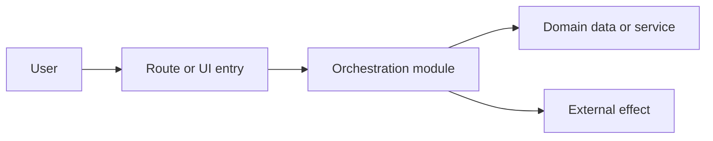
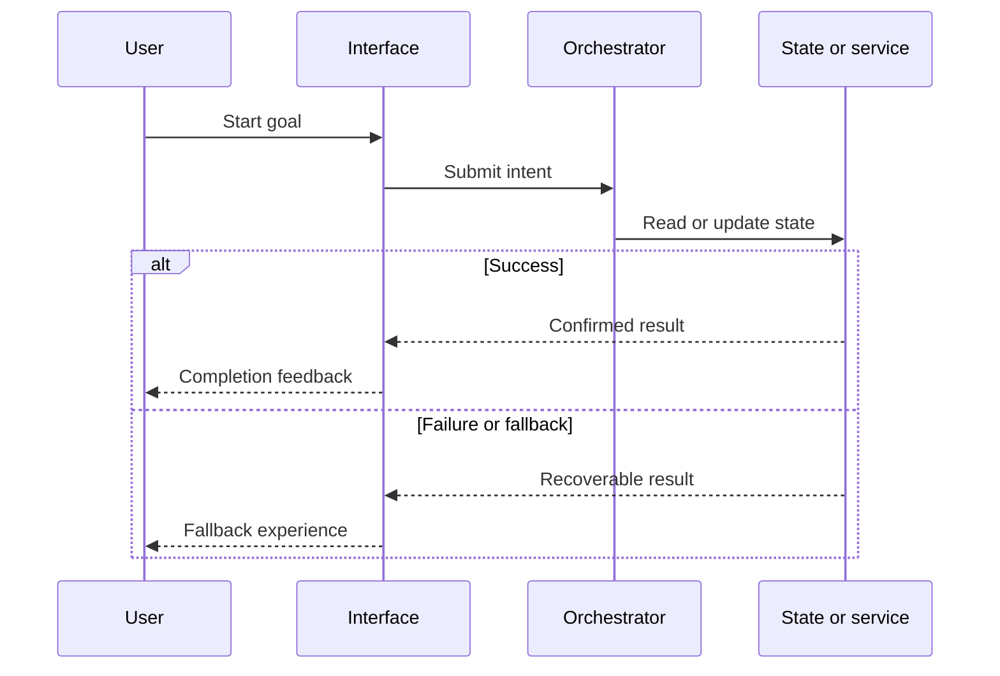

# RepoLens report schema

Use this reference when writing any RepoLens report. Treat source code, project
documentation, dependency manifests, test configuration, PR metadata, and Git
history as evidence. Do not present a claim as fact unless the evidence snapshot
supports it.

## Contents

- Evidence rules
- Runtime metadata and profile limits
- Diagram rules
- Architecture Map report
- Repository report
- Pull-request report
- Migration report extension
- Risk and confidence rubric

## Evidence rules

1. Analyze the exact commit recorded as `resolved_ref` in `manifest.json`.
2. Cite collected source as `` `path/to/file.ts:12-28` ``. Cite collector
   artifacts such as a PR diff as
   `` `@snapshot/pull-request.patch:12-28` ``.
3. Cite the smallest range that supports the claim.
4. Use only files under the snapshot's `files/` directory or these allowlisted
   collector artifacts: `manifest.json`, `pull-request-files.json`,
   `pull-request.patch`, `recent-commits.json`, and `tree.txt`.
5. Label cross-file deductions as `Inference` and cite every supporting file.
6. Label plausible but unverified statements as `Hypothesis`.
7. Never invent runtime behavior from a filename alone.
8. Report missing tests, documentation, or configuration as absence only after
   checking `tree.txt` and the collected files.
9. Include the full analyzed commit SHA near the top of the report.
10. Add `Confidence: High`, `Confidence: Medium`, or `Confidence: Low` to each
    material risk or inferred business flow.

## Runtime metadata and profile limits

Every report draft must include this block near the top. Populate collection and
coverage fields from collector/context JSON, but preserve the final two
placeholders until `finalize_report.py` replaces them.

```text
Profile: Quick | Deep
Collection: cache hit | fresh; N files; X seconds
Coverage: COLLECTED_FILES/TEXT_CANDIDATES text candidates
Tree entries: TREE_ENTRIES
Reasoning evidence: R files
Missing layers: none | comma-separated layers
Tests executed: yes (COMMAND) | no
Report validation: {{REPOLENS_VALIDATION_STATUS}}
Total elapsed: {{REPOLENS_TOTAL_ELAPSED}}
```

The finalizer replaces the validation placeholder with `passed` only when the
report finishes within its profile deadline. A structurally valid late report
uses `passed-with-deadline-limit` and must disclose potentially incomplete
coverage.

Quick requirements:

- Maximum 10,000 Markdown characters, enforced by the finalizer.
- One compact architecture diagram and one representative business-flow diagram.
- No more than five prioritized risks and recommendations.
- An 8–12 item evidence index.
- Use one representative flow with the strongest evidence. Do not call it the
  primary or most important flow unless repository evidence proves that status.

Deep requirements:

- Maximum 35,000 Markdown characters, enforced by the finalizer.
- Up to three business flows when the additional evidence changes engineering
  decisions.
- Preserve prioritization; Deep means wider evidence, not unbounded prose.

## Architecture Map report

Use exactly these level-two headings. Quick is limited to 7,000 Markdown
characters, exactly two Mermaid diagrams, and no more than five prioritized
risks. Deep preserves the same headings while widening evidence coverage.

```markdown
# Engineering Power Architecture Map

Analyzed target: OWNER/REPOSITORY | /local/repository/path
Analyzed commit: FULL_SHA
Authentication: github-app | environment-token | anonymous-public | local-filesystem
Profile: Quick | Deep
Collection: cache hit | fresh; N files; X seconds
Coverage: COLLECTED_FILES/TEXT_CANDIDATES text candidates
Tree entries: TREE_ENTRIES
Reasoning evidence: R files
Missing layers: none | comma-separated layers
Tests executed: yes (COMMAND) | no
Report validation: {{REPOLENS_VALIDATION_STATUS}}
Total elapsed: {{REPOLENS_TOTAL_ELAPSED}}

## Target and Evidence

## System Context and Runtime Units

## Module Boundaries and Dependencies

## Architecture Diagram

Include one repository-specific Mermaid architecture diagram and citations.

## Concrete Feature Flow

Trace and draw at least one Page/Route → Provider/Service → Client/DAO chain
using real repository symbols. Include confidence and citations.

## Trust, State, and External Boundaries

## Risks and Incremental Target State

Prioritize 1–5 findings in Quick. Recommend incremental boundaries rather than
a generic rewrite.

## Unknowns

## Evidence Index
```

## Diagram rules

Use Mermaid fenced blocks so reports render in Codex and GitHub Markdown.

### Architecture diagram

Generate at least one architecture diagram for a repository report. Show real
code boundaries rather than generic boxes. Prefer modules, routes, services,
state stores, external APIs, and persistent data sources that are visible in the
evidence.



Follow each architecture diagram with an `Evidence` list that cites the modules
represented in the diagram.

### Business logic flows

Generate at least one business-logic diagram for a repository report, even if
the project is a frontend. A business flow must show a meaningful user or system
goal, not merely file imports.

Trace each flow through these stages when evidence exists:

1. Trigger or user intent
2. Entry point
3. Validation or eligibility rules
4. State transition or orchestration
5. Data read/write or external effect
6. Success feedback
7. Failure, fallback, retry, or recovery behavior

Prefer a sequence diagram when order matters:



Use a flowchart for decisions, branches, state transitions, or multiple entry
points. Quote labels containing punctuation. Keep node identifiers simple and
keep a single diagram focused. Split unrelated flows instead of creating an
unreadable wall.

For an explicit Deep report with multiple important journeys, document up to
three flows:

- Primary user value flow
- State/progress lifecycle
- Failure, fallback, or integration flow

### Pull-request diagrams

Generate at least one diagram for a pull-request report. Choose the smallest
diagram that explains the behavioral change:

- Change propagation: changed symbol to downstream behavior and tests
- Before/after flow: changed decision, state transition, or external effect
- Sequence: changed request or user interaction order

Do not draw a business behavior change when a PR only changes documentation or
formatting. Draw a change-scope diagram and explicitly say that runtime behavior
is not affected.

## Repository report

Use exactly these level-two headings so automated validation can check the
report.

```markdown
# RepoLens Repository Intelligence Report

Analyzed target: OWNER/REPOSITORY | /local/repository/path
Analyzed commit: FULL_SHA
Authentication: github-app | environment-token | anonymous-public | local-filesystem
Profile: Quick | Deep
Collection: cache hit | fresh; N files; X seconds
Coverage: COLLECTED_FILES/TEXT_CANDIDATES text candidates
Tree entries: TREE_ENTRIES
Reasoning evidence: R files
Missing layers: none | comma-separated layers
Tests executed: yes (COMMAND) | no
Report validation: {{REPOLENS_VALIDATION_STATUS}}
Total elapsed: {{REPOLENS_TOTAL_ELAPSED}}

## Executive Summary

Explain the product purpose, principal users, primary value, maturity, and the
most important engineering observation.

## Repository Map

Describe the technology stack, top-level layout, entry points, configuration,
and important data or content modules. Use a compact table where useful.

## Architecture Diagram

Include the architecture Mermaid diagram and its evidence.

## Business Logic Flows

Explain and draw the representative business journey in Quick, or up to three
evidence-backed journeys in Deep. For each flow include purpose,
preconditions, main path, state changes, fallback behavior, confidence, and
evidence.

## Developer Onboarding

Give a practical reading order, local startup path, common modification points,
and questions a new engineer should clarify.

## Build, Test, and Operations

List only commands and operational behavior supported by repository evidence.
Separate tests that exist from tests that are merely recommended.

## Risks and Recommendations

Prioritize evidence-backed architecture, correctness, maintainability, testing,
security, performance, and operational risks. Do not manufacture findings to
fill categories.

## Evidence Index

List the most important files and what each one proves.
```

## Pull-request report

Use exactly these level-two headings.

```markdown
# RepoLens Pull Request Intelligence Report

Analyzed PR: OWNER/REPOSITORY#NUMBER | Local KIND simulation
Local source: /local/repository/path (local simulation only)
Base commit: FULL_SHA
Head commit: FULL_SHA | unavailable for patch-file simulation
Profile: Quick | Deep
Collection: cache hit | fresh; N files; X seconds
Coverage: COLLECTED_FILES/TEXT_CANDIDATES text candidates
Tree entries: TREE_ENTRIES
Reasoning evidence: R files
Missing layers: none | comma-separated layers
Tests executed: yes (COMMAND) | no
Report validation: {{REPOLENS_VALIDATION_STATUS}}
Total elapsed: {{REPOLENS_TOTAL_ELAPSED}}

## Change Summary

Explain the user-visible and technical changes. Separate facts from inference.

## Change Propagation

Draw the affected path from changed files or symbols to downstream modules,
business behaviors, state, external effects, and tests.

## Business Logic Impact

Describe changed rules, decisions, state transitions, success paths, failure
paths, and invariants. Include a diagram when behavior changes.

## Test Impact

Separate existing relevant tests, tests likely affected, commands to run, and
new scenarios to add. Never claim that a test passed unless execution evidence
exists.

## Regression Risk

Give an overall level and individual findings with rationale, confidence, and
source evidence.

## Architecture Review

Check module boundaries, duplicated responsibility, dependency direction,
public interfaces, data ownership, and repository-specific conventions.

## Evidence Index

List changed and supporting files with their role in the analysis.
```

For a local simulation, include `Simulation: git-range | working-tree |
patch-file` near the top. For working-tree mode, disclose that the snapshot is
mutable. For patch-file mode, disclose that the patch was not applied and cite
the patch itself for proposed code rather than treating context files as the
post-change implementation.

## Migration report extension

For a migration request based on a repository URL, still include all repository
headings so the report remains valid. Add these level-two sections before the
Evidence Index:

- `## Migration Inventory`
- `## Migration Waves`
- `## Validation and Rollback`

Use deterministic search to inventory affected APIs and configuration. Build
migration waves from dependency order. Distinguish required edits, recommended
cleanup, and unknown compatibility questions.

## Risk and confidence rubric

### Risk

- `Critical`: credible path to data loss, security breach, irreversible state,
  or widespread production failure.
- `High`: core behavior or shared boundary changes with weak containment or
  validation.
- `Medium`: meaningful behavior change with limited blast radius, fallback, or
  reasonable validation.
- `Low`: isolated and reversible change with strong evidence and coverage.
- `Informational`: no defect claim; observation or improvement opportunity.

Risk is not confidence. A high-impact hypothesis with weak evidence should be
reported as high potential impact and low confidence, not as a confirmed high
risk defect.

### Confidence

- `High`: directly supported by implementation and configuration or tests.
- `Medium`: supported by consistent evidence across multiple files but not
  confirmed at runtime.
- `Low`: partial evidence, missing dependencies, truncated diff, or behavior
  depends on unavailable systems.
