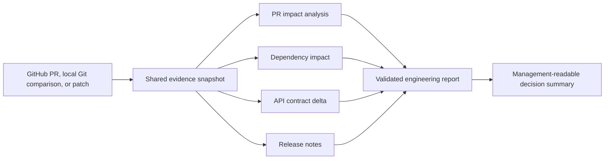

# Engineering Power

Evidence-backed AI engineering workflows for GitHub Copilot, Claude Code,
Cursor, and Codex.

Engineering Power helps engineers understand repositories and review changes
without treating model intuition as source truth. It accepts GitHub repositories,
pull requests, local Git repositories, commit comparisons, working-tree changes,
and downloaded patches. Reports retain the analyzed Git state, source citations,
test status, collection coverage, and explicit unknowns.

## Why it exists

General-purpose AI can summarize code, but engineering decisions need stronger
evidence. Engineering Power combines a deterministic repository evidence engine
with focused agent workflows so that material conclusions can be traced back to
concrete files and line ranges.

The product is designed around three rules:

- distinguish facts, inferences, and unknowns;
- distinguish executed tests from discovered or recommended tests;
- return bounded partial coverage when a deadline is reached instead of silently
  continuing or overstating completeness.

## Current capabilities

The current Demo MVP includes:

| Workflow | Engineering outcome |
| --- | --- |
| Repository Intelligence | Architecture, business flows, build paths, risks, and onboarding guidance |
| PR Impact Analysis | Change propagation, test impact, regression risk, and architecture review |
| Dependency Impact Analysis | Direct and transitive consumer, build, runtime, and test impact |
| API Contract Generator | Endpoint and schema inventory or compatibility delta |
| Release Note Generator | Evidence-backed technical and user-facing release notes |
| Architecture Map | Module, trust, data-ownership, integration, and business-flow maps |
| Codebase Onboarding | Practical reading order, setup, common change locations, and test paths |
| Migration Planner | Evidence-backed migration waves, validation gates, and rollback points |
| Release Readiness | Test, configuration, deployment, observability, rollback, and release decision brief |

Engineering lifecycle workflows are also included for brainstorming, planning,
test-driven development, systematic debugging, code review, verification, Git
worktrees, and safely finishing development work.

Repository refactoring assistance and runtime incident triage are planned for
the project-validation stage. They are intentionally not presented as completed
Demo MVP capabilities.

## Golden PR workflow

One exact repository or change snapshot is collected and then reused across
derived reports:



This avoids independently recrawling the same change and keeps all conclusions
grounded in the same base and head state.

## Cross-platform installation

Engineering Power ships as a suite of **20 individual Skills** plus one
`engineering-power` router and shared runtime core. GitHub Copilot, Claude Code,
and Cursor can discover each workflow separately—for example
`.agents/skills/pr-impact-analysis`—or use the router when the required workflow
is not yet known.

The root [`skills/`](skills) directory is the canonical source shared with the
Codex Plugin. The 20 host-neutral copies under [`.agents/skills`](.agents/skills)
are generated artifacts; do not edit them directly. After changing a canonical
Skill, `scripts/repo_evidence/`, or `references/`, refresh and verify the
committed suite:

```bash
python3 scripts/sync_portable_agent_skill.py
python3 scripts/sync_portable_agent_skill.py --check
```

From the Engineering Power repository, install into a target project directory:

```bash
# GitHub Copilot CLI or VS Code agent
python3 scripts/install_agent_skill.py --host copilot --target-root /path/to/project

# Claude Code
python3 scripts/install_agent_skill.py --host claude --target-root /path/to/project

# Cursor
python3 scripts/install_agent_skill.py --host cursor --target-root /path/to/project
```

The created locations are respectively:

```text
/path/to/project/.agents/skills/       # GitHub Copilot
/path/to/project/.claude/skills/       # Claude Code
/path/to/project/.cursor/skills/       # Cursor
```

Each host Skills root receives the same **21 directories**. Installation
preserves unrelated Skills; `--force` replaces only Engineering Power's managed
suite.

For GitHub Copilot CLI, start or reload a session and verify both the router and
the individual Skills:

```text
/skills reload
/skills list
/skills info engineering-power
/skills info pr-impact-analysis
```

GitHub Copilot, Claude Code, and Cursor can all run the local Git workflows:
repositories cloned from Bitbucket, branch comparisons, working-tree changes,
and downloaded patches. This is the supported path for repositories reachable
only while connected to a corporate VPN. GitHub cloud agents are suitable for
GitHub repositories and PRs, but cannot access a developer's local checkout or
company VPN.

## Example usage

Select an individual Engineering Power Skill from your agent host. Use the
`engineering-power` router only when you want the host to choose the workflow:

```text
$repo-intelligence /path/to/repository

$pr-impact-analysis /path/to/repository compare BASE_REF HEAD_REF

$pr-impact-analysis https://github.com/OWNER/REPOSITORY/pull/123 full golden path

$api-contract-generator /path/to/repository working-tree base main

$release-readiness /path/to/repository compare main feature-branch
```

Local repositories and downloaded patches support offline analysis, including
repositories downloaded from Bitbucket while disconnected from a corporate VPN.
Target repositories are treated as read-only unless the user explicitly requests
and authorizes an implementation workflow.

## Runtime profiles

- **Quick** is the default, targets about two minutes, and has a 120-second
  evidence-collection deadline.
- **Deep** must be requested explicitly and has a 300-second deadline.
- An identical Git state reuses its cached evidence snapshot.
- Reports that exceed their profile deadline are finalized with a coverage
  limitation rather than represented as unrestricted results.

## Codex Plugin development and local update

The canonical source repository is:

```text
https://github.com/gavinliu1995/engineering-power
```

In the current developer environment, the personal marketplace entry points to
the local checkout through `~/plugins/engineering-power`. After editing and
validating the source, publish a new local plugin snapshot with:

```bash
PLUGIN_ROOT="$HOME/Documents/engineering-power"

python3 "$HOME/.codex/skills/.system/plugin-creator/scripts/update_plugin_cachebuster.py" \
  "$PLUGIN_ROOT"

codex plugin add engineering-power@personal
```

Start a new Codex task after reinstalling so that the updated skill registry is
loaded. Editing the source repository alone does not hot-update the installed
plugin cache. This Codex-specific adapter remains available alongside the
standard cross-platform Agent Skill package.

## Validation

Run the full deterministic test suite:

```bash
python3 -m unittest discover -s tests -v
```

Validate the plugin manifest:

```bash
python3 "$HOME/.codex/skills/.system/plugin-creator/scripts/validate_plugin.py" .
```

Validate every skill contract:

```bash
for skill in skills/*; do
  python3 "$HOME/.codex/skills/.system/skill-creator/scripts/quick_validate.py" "$skill"
done
```

The automated suite covers plugin layout, local and GitHub evidence behavior,
cache reuse and permissions, deadlines, report validation, workflow-specific
context selection, and specialized report contracts.

## Ownership and release governance

- **Owner:** Gavin Liu. The owner approves scope, release readiness, and changes
  to the evidence or safety contracts.
- **Maintainer responsibilities:** keep the portable Agent Skill synchronized,
  review host compatibility, triage defects, and ensure reports remain
  evidence-backed and read-only by default.
- **Review cadence:** review quarterly, before each team release, and after a
  material GitHub Copilot, Claude Code, Cursor, or Codex skill-format change.
- **Release checklist:**
  1. Run `python3 scripts/sync_portable_agent_skill.py --check`.
  2. Run the full deterministic test suite and both Skill and Plugin validators.
  3. Install the portable package in a clean target and run a local-repository
     and change-analysis smoke test.
  4. Confirm no credentials, private keys, source snapshots, or local worktree
     payloads are tracked.
  5. Record known limitations and require human review before expanding write
     permissions or team rollout.

## Architecture

```text
skills/                 Canonical source for 20 Codex Plugin Skills
.agents/skills/         Generated 20 Agent Skills plus router/runtime core
scripts/repo_evidence/  Deterministic GitHub, local Git, diff, cache, and validation engine
scripts/sync_portable_agent_skill.py  Canonical-to-portable deterministic generator
scripts/install_agent_skill.py  Host-specific 21-Skill suite installer
references/             Evidence rules, report schemas, and workflow guidance
tests/                  Plugin, collector, cache, report, and skill-contract tests
```

The shared evidence engine remains internally identifiable as RepoLens where
that name is useful for compatibility. Engineering Power is the user-facing
plugin and workflow product.

## Delivery roadmap

1. **Demo MVP — prove usefulness:** demonstrate the golden PR workflow and
   evidence quality on representative repositories and changes.
2. **Project validation — prove reliability:** add refactoring and incident
   workflows, then measure correctness, actionability, omissions, runtime, and
   maintainer satisfaction on real projects.
3. **Plugin product — prove scalability:** add team configuration, consistent
   routing, installation and upgrade workflows, and broader internal adoption.

See
[`docs/superpowers/specs/2026-07-15-engineering-power-capability-roadmap-design.md`](docs/superpowers/specs/2026-07-15-engineering-power-capability-roadmap-design.md)
for the detailed capability and validation gates, and
[`references/demo-golden-path.md`](references/demo-golden-path.md) for the Demo
MVP execution contract.
