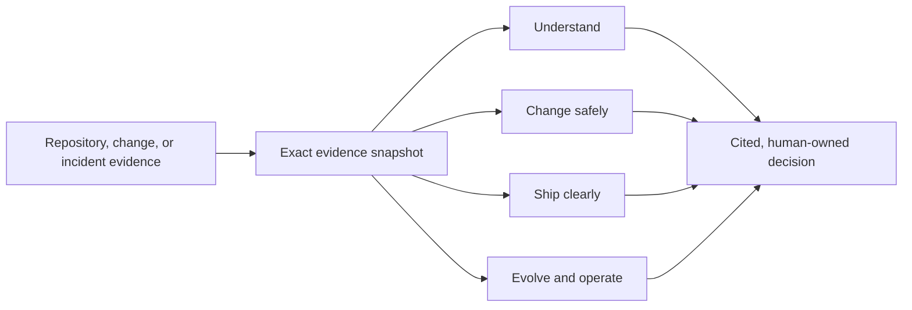

# Engineering Power

Evidence-backed engineering intelligence across the software lifecycle for
Codex, GitHub Copilot, Claude Code, and Cursor.

Engineering Power helps engineers understand unfamiliar repositories, change
code safely, ship clearly, plan migrations, and investigate runtime incidents
without treating model intuition as source truth.

## Current capabilities

Engineering Power covers the full engineering lifecycle:

| Stage | Integrated capabilities | Supporting workflows |
| --- | --- | --- |
| Understand | Repository-specific onboarding; Architecture review support | Repository Intelligence; Architecture Map; Codebase Onboarding |
| Change safely | Repository refactoring assistance; Dependency impact analysis; Test impact analysis; Regression risk detection | PR Impact Analysis |
| Ship clearly | API contract generation; Release note generation | Release Readiness |
| Evolve & operate | Migration planning; Runtime incident triage | Migration Planner; Systematic Debugging |

## Shared evidence across the lifecycle

One exact repository, change, or incident snapshot is collected and then reused
across lifecycle workflows:



This avoids independently recrawling the same evidence and keeps all conclusions
grounded in the same exact state.

## Example usage

Select a skill from Codex and provide a target:

```text
$repo-intelligence /path/to/repository

$pr-impact-analysis /path/to/repository compare BASE_REF HEAD_REF

$pr-impact-analysis https://github.com/OWNER/REPOSITORY/pull/123 full golden path

$api-contract-generator /path/to/repository working-tree base main

$release-readiness /path/to/repository compare main feature-branch
```

Local repositories and downloaded patches support offline analysis, including
repositories downloaded from Bitbucket while disconnected from a corporate VPN.
Target repositories are treated as read-only unless the user explicitly requests
and authorizes an implementation workflow.

## Runtime profiles

- **Quick** is the default, targets about two minutes, and has a 120-second
  evidence-collection deadline.
- **Deep** must be requested explicitly and has a 300-second deadline.
- An identical Git state reuses its cached evidence snapshot.
- Reports that exceed their profile deadline are finalized with a coverage
  limitation rather than represented as unrestricted results.

## Plugin development and local update

The canonical source repository is:

```text
https://github.com/gavinliu1995/engineering-power
```

In the current developer environment, the personal marketplace entry points to
the local checkout through `~/plugins/engineering-power`. After editing and
validating the source, publish a new local plugin snapshot with:

```bash
PLUGIN_ROOT="$HOME/Documents/engineering-power"

python3 "$HOME/.codex/skills/.system/plugin-creator/scripts/update_plugin_cachebuster.py" \
  "$PLUGIN_ROOT"

codex plugin add engineering-power@personal
```

Start a new Codex task after reinstalling so that the updated skill registry is
loaded. Editing the source repository alone does not hot-update the installed
plugin cache.

## Validation

Run the full deterministic test suite:

```bash
python3 -m unittest discover -s tests -v
```

Validate the plugin manifest:

```bash
python3 "$HOME/.codex/skills/.system/plugin-creator/scripts/validate_plugin.py" .
```

Validate every skill contract:

```bash
for skill in skills/*; do
  python3 "$HOME/.codex/skills/.system/skill-creator/scripts/quick_validate.py" "$skill"
done
```

The automated suite covers plugin layout, local and GitHub evidence behavior,
cache reuse and permissions, deadlines, report validation, workflow-specific
context selection, and specialized report contracts.

## Architecture

```text
skills/                 User-invoked engineering workflows
scripts/repo_evidence/  Deterministic GitHub, local Git, diff, cache, and validation engine
references/             Evidence rules, report schemas, and workflow guidance
tests/                  Plugin, collector, cache, report, and skill-contract tests
```

The shared evidence engine remains internally identifiable as RepoLens where
that name is useful for compatibility. Engineering Power is the user-facing
plugin and workflow product.

## Delivery roadmap

1. **Demo MVP — prove usefulness:** demonstrate the golden PR workflow and
   evidence quality on representative repositories and changes.
2. **Project validation — prove reliability:** measure correctness,
   actionability, omissions, runtime, and maintainer satisfaction across the
   integrated lifecycle workflows on representative projects.
3. **Plugin product — prove scalability:** add team configuration, consistent
   routing, installation and upgrade workflows, and broader internal adoption.

See
[`docs/superpowers/specs/2026-07-15-engineering-power-capability-roadmap-design.md`](docs/superpowers/specs/2026-07-15-engineering-power-capability-roadmap-design.md)
for the detailed capability and validation gates, and
[`references/demo-golden-path.md`](references/demo-golden-path.md) for the Demo
MVP execution contract.

## Static demo deployment

The static Engineering Power demo is a Vite single-page application. From this
repository, install dependencies and start local development with:

```bash
npm install
npm run dev
```

Create the production bundle with:

```bash
npm run build
```

To deploy on Vercel, import this repository in the Vercel dashboard and accept
the detected Vite build settings. The included `vercel.json` rewrites direct
visits to application routes, including `/demo-report`, to the SPA entry point.
