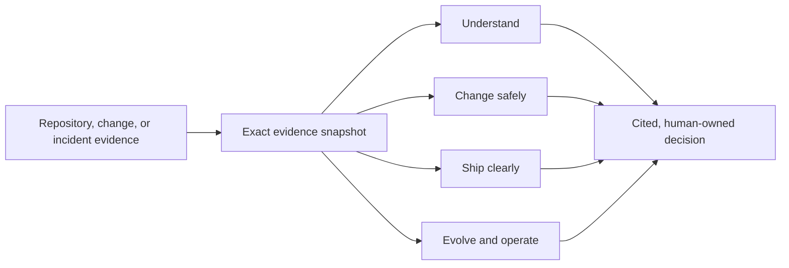

# Engineering Power Full-Lifecycle Landing Implementation Plan

> **For agentic workers:** REQUIRED SUB-SKILL: Use engineering-power:subagent-driven-development (recommended) or engineering-power:executing-plans to implement this plan task-by-task. Steps use checkbox (`- [ ]`) syntax for tracking.

**Goal:** Reposition the static Vercel site from a PR-review-led demo to a premium, evidence-backed Engineering Power product story spanning repository understanding, safe change, clear shipping, migration, and incident response.

**Architecture:** Keep the Vite SPA and existing routes, hero flow field, brand asset, and host-specific installation guides. Add one typed lifecycle content model, compose the home page from focused editorial components, share a controlled accessible tab primitive between the capability explorer and the four-scenario demo, and keep every interaction local with no backend.

**Tech Stack:** React 19, TypeScript 5.8, React Router 7, Framer Motion 12, React Three Fiber 9, Three.js, CSS, Vitest 3, Testing Library.

## Global Constraints

- Work only in `/Users/gavin.liu/Documents/engineering-power-vercel-app` on branch `vercel-demo`; do not modify the canonical Engineering Power repository or its `main` branch.
- All public website copy remains English.
- Present all ten confirmed assigned capabilities as currently available: Repository-specific onboarding, Architecture review support, Repository refactoring assistance, Dependency impact analysis, Test impact analysis, Regression risk detection, API contract generation, Release note generation, Migration planning, and Runtime incident triage.
- Present PR Impact Analysis only as a supporting workflow inside **Change safely**; it must not be the hero promise, default tab, or default demo.
- Default both interactive experiences to **Understand**.
- Keep the Citation Frame brand asset, black/graphite and warm off-white surfaces, chartreuse accent, abstract Intelligence Flow Field, and calm mouse response.
- Do not add a backend, API route, repository upload, authentication, billing, analytics, persistence, environment variable, new Three.js scene, or new npm dependency.
- Every demo panel must visibly say `Illustrative static example`; never imply that the website performed live repository analysis.
- Preserve `/`, `/demo-report`, `/start`, all four `/start/<host>` routes, the custom 404, the canonical GitHub URL, return-home navigation, and route-change focus restoration.
- Keep all tab panels mounted and use the native `hidden` attribute for inactive panels.
- Tabs must support ArrowLeft, ArrowRight, Home, and End with automatic selection and focus movement.
- Keep the hero canvas decorative with `aria-hidden="true"`; preserve WebGL fallback behavior and `prefers-reduced-motion` demand rendering.
- Support layouts from 320px upward, keep every capability name readable without horizontal page scrolling, and never rely on chartreuse alone to indicate selection.
- Update the website repository README so it no longer calls repository refactoring assistance or runtime incident triage planned work.
- The current baseline is 28 passing frontend tests and a passing production build. The existing Vite chunk-size warning is non-blocking and does not justify adding code splitting to this scope.

---

### Task 1: Add the typed lifecycle model, fixtures, and truthful README

**Files:**
- Create: `src/content/siteContent.test.ts`
- Modify: `src/content/siteContent.ts:1-245`
- Modify: `README.md:1-75,140-170`

**Interfaces:**
- Produces: `LifecycleStageId`, `AssignedCapabilityName`, `LifecycleCapability`, `LifecycleStage`, `DemoScenario`, `StarterPrompt`, `lifecycleStageIds`, `assignedCapabilityNames`, `lifecycleStages`, `demoScenarios`, `howItWorksSteps`, `supportedHosts`, and `lifecycleStarterPrompts`.
- Preserves: the current `DemoReport` type and `reportData` value for the detailed **Change safely** report.
- Does not yet remove: `evidenceFlow`, `outputs`, `homepageEvidenceStates`, or their legacy copy; Task 2 removes them after the old homepage consumers are gone so this task remains buildable.

- [ ] **Step 1: Write failing content-invariant tests**

Create `src/content/siteContent.test.ts`:

```ts
import { describe, expect, test } from "vitest";
import {
  assignedCapabilityNames,
  demoScenarios,
  lifecycleStageIds,
  lifecycleStages,
  lifecycleStarterPrompts,
} from "./siteContent";

describe("full-lifecycle site content", () => {
  test("maps every assigned capability exactly once", () => {
    const renderedNames = lifecycleStages.flatMap((stage) =>
      stage.capabilities
        .filter((capability) => capability.role === "assigned")
        .map((capability) => capability.name),
    );

    expect(assignedCapabilityNames).toHaveLength(10);
    expect(new Set(assignedCapabilityNames)).toHaveProperty("size", 10);
    expect([...renderedNames].sort()).toEqual([...assignedCapabilityNames].sort());
  });

  test("defaults the ordered lifecycle to repository understanding", () => {
    expect(lifecycleStages.map((stage) => stage.id)).toEqual(lifecycleStageIds);
    expect(lifecycleStages[0].id).toBe("understand");
  });

  test("defines one complete illustrative scenario per lifecycle stage", () => {
    expect(demoScenarios.map((scenario) => scenario.id)).toEqual(lifecycleStageIds);

    for (const scenario of demoScenarios) {
      expect(scenario.disclosure).toBe("Illustrative static example");
      expect(scenario.outputs).toHaveLength(3);
      expect(scenario.evidence.length).toBeGreaterThanOrEqual(2);
      expect(scenario.target).not.toBe("");
      expect(scenario.gitState).not.toBe("");
      expect(scenario.unknown.statement).not.toBe("");
      expect(scenario.nextDecision.owner).not.toBe("");
      expect(scenario.nextDecision.action).not.toBe("");
    }

    expect(demoScenarios[1].target).toBe(
      "Pull request #482 · checkout-tax-rounding",
    );
  });

  test("provides one starter prompt for every stage", () => {
    expect(lifecycleStarterPrompts.map((prompt) => prompt.stage)).toEqual(
      lifecycleStageIds,
    );
  });
});
```

- [ ] **Step 2: Run the focused test to verify RED**

Run: `npm test -- --run src/content/siteContent.test.ts`

Expected: FAIL because the lifecycle exports do not exist.

- [ ] **Step 3: Add exact lifecycle types and capability data**

Add below the existing report types in `src/content/siteContent.ts`:

```ts
export const lifecycleStageIds = [
  "understand",
  "change-safely",
  "ship-clearly",
  "evolve-operate",
] as const;

export type LifecycleStageId = (typeof lifecycleStageIds)[number];

export const assignedCapabilityNames = [
  "Repository-specific onboarding",
  "Architecture review support",
  "Repository refactoring assistance",
  "Dependency impact analysis",
  "Test impact analysis",
  "Regression risk detection",
  "API contract generation",
  "Release note generation",
  "Migration planning",
  "Runtime incident triage",
] as const;

export type AssignedCapabilityName =
  (typeof assignedCapabilityNames)[number];

export type SupportingCapabilityName =
  | "Repository Intelligence"
  | "PR Impact Analysis"
  | "Release Readiness"
  | "Systematic Debugging";

export type LifecycleCapability =
  | {
      role: "assigned";
      name: AssignedCapabilityName;
      description: string;
    }
  | {
      role: "supporting";
      name: SupportingCapabilityName;
      description: string;
    };

export type LifecycleStage = {
  id: LifecycleStageId;
  number: "01" | "02" | "03" | "04";
  title: "Understand" | "Change safely" | "Ship clearly" | "Evolve & operate";
  outcome: string;
  question: string;
  capabilities: readonly LifecycleCapability[];
  exampleOutput: string;
  evidenceInput: string;
};

export type ScenarioOutput = {
  title: string;
  summary: string;
  items: readonly string[];
};

export type DemoScenario = {
  id: LifecycleStageId;
  title: LifecycleStage["title"];
  disclosure: "Illustrative static example";
  heading: string;
  target: string;
  gitState: string;
  question: string;
  summary: string;
  outputs: readonly [ScenarioOutput, ScenarioOutput, ScenarioOutput];
  evidence: readonly [EvidenceItem, EvidenceItem, ...EvidenceItem[]];
  unknown: { statement: string; neededEvidence: string };
  nextDecision: { owner: string; action: string };
  detailReport?: DemoReport;
};

export type StarterPrompt = {
  stage: LifecycleStageId;
  title: LifecycleStage["title"];
  prompt: string;
};
```

Add the ordered lifecycle data:

```ts
export const lifecycleStages = [
  {
    id: "understand",
    number: "01",
    title: "Understand",
    outcome: "Get oriented before you make a change.",
    question:
      "How does this repository work, where should I start, and which boundaries matter?",
    capabilities: [
      {
        role: "assigned",
        name: "Repository-specific onboarding",
        description: "A practical reading order, setup path, and common change locations.",
      },
      {
        role: "assigned",
        name: "Architecture review support",
        description: "Module boundaries, ownership, business flows, and design risks.",
      },
      {
        role: "supporting",
        name: "Repository Intelligence",
        description: "A cited overview of structure, build paths, and risk areas.",
      },
    ],
    exampleOutput:
      "Architecture map, checkout flow, setup path, and recommended reading order.",
    evidenceInput:
      "One repository revision plus available documentation, build files, source, and tests.",
  },
  {
    id: "change-safely",
    number: "02",
    title: "Change safely",
    outcome: "Plan and review changes with downstream effects visible.",
    question:
      "What should change, what depends on it, and how could the change regress?",
    capabilities: [
      {
        role: "assigned",
        name: "Repository refactoring assistance",
        description: "A sequenced refactor plan with safe checkpoints and rollback boundaries.",
      },
      {
        role: "assigned",
        name: "Dependency impact analysis",
        description: "Direct and transitive consumers across code, configuration, build, and runtime.",
      },
      {
        role: "assigned",
        name: "Test impact analysis",
        description: "Executed, discovered, and recommended checks kept distinct.",
      },
      {
        role: "assigned",
        name: "Regression risk detection",
        description: "Evidence-backed failure modes, affected behavior, and unresolved risk.",
      },
      {
        role: "supporting",
        name: "PR Impact Analysis",
        description: "A pull request is one possible input, not the product boundary.",
      },
    ],
    exampleOutput:
      "Refactor sequence, dependency and test impact, regression risks, and review conditions.",
    evidenceInput:
      "A repository, pull request, local comparison, working tree, or patch at an exact Git state.",
  },
  {
    id: "ship-clearly",
    number: "03",
    title: "Ship clearly",
    outcome: "Make compatibility, communication, and release conditions explicit.",
    question:
      "What changed at the interface, what should people know, and what must be true before release?",
    capabilities: [
      {
        role: "assigned",
        name: "API contract generation",
        description: "Endpoint, schema, and compatibility changes tied to repository evidence.",
      },
      {
        role: "assigned",
        name: "Release note generation",
        description: "Technical and user-facing notes grounded in the same change snapshot.",
      },
      {
        role: "supporting",
        name: "Release Readiness",
        description: "Validation status, risks, rollback signals, and a human-owned release decision.",
      },
    ],
    exampleOutput:
      "API compatibility delta, technical and user-facing release notes, and release conditions.",
    evidenceInput:
      "An exact comparison plus API definitions, tests, deployment configuration, and release documentation.",
  },
  {
    id: "evolve-operate",
    number: "04",
    title: "Evolve & operate",
    outcome: "Modernize systems and investigate failures without losing evidence.",
    question:
      "How should this system evolve, and what evidence best explains the current failure?",
    capabilities: [
      {
        role: "assigned",
        name: "Migration planning",
        description: "Migration waves, validation gates, dependency order, and rollback points.",
      },
      {
        role: "assigned",
        name: "Runtime incident triage",
        description: "Ranked hypotheses with supporting, contradicting, and missing evidence.",
      },
      {
        role: "supporting",
        name: "Systematic Debugging",
        description: "Evidence-first diagnosis before corrective implementation.",
      },
    ],
    exampleOutput:
      "Migration waves or ranked incident hypotheses with validation and rollback gates.",
    evidenceInput:
      "The repository state plus a target platform or bounded incident evidence such as symptoms, logs, and runbooks.",
  },
] as const satisfies readonly LifecycleStage[];
```

- [ ] **Step 4: Add the shared workflow, host, prompt, and demo fixtures**

Add these shared arrays:

```ts
export const howItWorksSteps = [
  {
    number: "01",
    title: "Choose the evidence",
    description:
      "Point Engineering Power at a repository, pull request, local comparison, working tree, patch, or bounded incident evidence.",
  },
  {
    number: "02",
    title: "Capture the exact state",
    description:
      "It records the Git state and collects a limited, traceable evidence snapshot before drawing conclusions.",
  },
  {
    number: "03",
    title: "Run the right workflow",
    description:
      "The selected workflow returns cited findings while keeping facts, inferences, unknowns, and validation states distinct.",
  },
  {
    number: "04",
    title: "Keep the decision human",
    description:
      "An engineer reviews the evidence, resolves the remaining unknowns, and owns the implementation or release decision.",
  },
] as const;

export const supportedHosts = [
  {
    id: "codex",
    name: "Codex",
    description: "Local developer preview for a configured personal marketplace.",
  },
  {
    id: "copilot",
    name: "GitHub Copilot",
    description: "Portable project skill for Copilot CLI or VS Code.",
  },
  {
    id: "claude",
    name: "Claude Code",
    description: "Portable project skill for repository-local Claude workflows.",
  },
  {
    id: "cursor",
    name: "Cursor",
    description: "Portable project skill for Cursor-assisted engineering work.",
  },
] as const;

export const lifecycleStarterPrompts = [
  {
    stage: "understand",
    title: "Understand",
    prompt:
      "Use Engineering Power to onboard me to this repository. Map its architecture and main business flows, then give me a cited reading order and setup path.",
  },
  {
    stage: "change-safely",
    title: "Change safely",
    prompt:
      "Use Engineering Power to plan a safe refactor of the checkout totals module. Trace dependency and test impact, surface regression risks, and cite the relevant files.",
  },
  {
    stage: "ship-clearly",
    title: "Ship clearly",
    prompt:
      "Use Engineering Power to generate the API compatibility delta and technical and user-facing release notes for this change, including release conditions and citations.",
  },
  {
    stage: "evolve-operate",
    title: "Evolve & operate",
    prompt:
      "Use Engineering Power to investigate this provider-reconciliation incident. Rank hypotheses with supporting and contradicting evidence, then recommend whether an integer-money migration should be planned.",
  },
] as const satisfies readonly StarterPrompt[];
```

Add the four `northstar-commerce` scenarios. Keep every string below visibly fictional and citation-shaped:

```ts
export const demoScenarios: readonly DemoScenario[] = [
  {
    id: "understand",
    title: "Understand",
    disclosure: "Illustrative static example",
    heading: "Map northstar-commerce before touching checkout.",
    target: "northstar-commerce repository",
    gitState: "main @ 8f31c2a",
    question:
      "How does checkout work, which boundary owns totals, and where should a new engineer start?",
    summary:
      "The storefront calls a checkout service that owns totals, tax orchestration, and payment-provider boundaries.",
    outputs: [
      {
        title: "Repository overview",
        summary: "The storefront owns cart interaction; the checkout service owns quote calculation and provider coordination.",
        items: ["Primary domain: checkout", "Public entry point: POST /checkout/quote", "External boundary: PaymentProviderAdapter"],
      },
      {
        title: "Checkout business flow",
        summary: "CartPage → checkout route → CheckoutService → TaxCalculator → PaymentProviderAdapter.",
        items: ["Tax lines are calculated before provider authorization.", "Integer cents cross the public API boundary."],
      },
      {
        title: "Start here",
        summary: "Read the route, orchestration service, and provider adapter before changing totals.",
        items: ["src/api/routes/checkout.ts", "src/checkout/CheckoutService.ts", "src/payments/PaymentProviderAdapter.ts", "Run the documented local checkout bootstrap."],
      },
    ],
    evidence: [
      { statement: "The checkout route delegates quote creation to CheckoutService.", citation: "src/api/routes/checkout.ts:L12-L38" },
      { statement: "CheckoutService composes tax calculation and provider reconciliation.", citation: "src/checkout/CheckoutService.ts:L24-L78" },
      { statement: "The repository documents a local checkout bootstrap path.", citation: "README.md:L18-L42" },
    ],
    unknown: {
      statement: "Whether payment-provider sandbox credentials are available to every new contributor.",
      neededEvidence: "Maintainer confirmation or a verified sandbox onboarding run.",
    },
    nextDecision: {
      owner: "Repository maintainer",
      action: "Confirm ownership of the provider adapter, then use checkout as the first onboarding change slice.",
    },
  },
  {
    id: "change-safely",
    title: "Change safely",
    disclosure: "Illustrative static example",
    heading: "Refactor checkout tax rounding with bounded risk.",
    target: "Pull request #482 · checkout-tax-rounding",
    gitState: "main @ 8f31c2a → feature/checkout-tax-rounding @ c7e194d",
    question: "How can the rounding refactor land without breaking totals or provider reconciliation?",
    summary: "Move tax rounding to the checkout boundary while keeping the integer-cents API contract unchanged.",
    outputs: [
      {
        title: "Refactor sequence",
        summary: "Introduce the boundary conversion first, update consumers second, and remove duplicate rounding last.",
        items: ["Add boundary conversion in TaxCalculator.", "Update CheckoutService consumers.", "Remove provider-specific duplicate rounding after validation."],
      },
      {
        title: "Dependency impact",
        summary: "Checkout totals affect the API response, persisted orders, and payment-provider reconciliation.",
        items: ["Checkout API response", "Order persistence", "Payment-provider adapters"],
      },
      {
        title: "Test and regression impact",
        summary: "Unit coverage exists; provider reconciliation and historical-cart behavior remain release risks.",
        items: ["Execute high-precision TaxCalculator cases.", "Add checkout response contract coverage.", "Replay provider reconciliation in staging."],
      },
    ],
    evidence: [
      { statement: "TaxCalculator rounds each tax line before adding it to the order total.", citation: "src/checkout/TaxCalculator.ts:L42-L61" },
      { statement: "The checkout response exposes totals as integer cents.", citation: "src/api/CheckoutResponse.ts:L18-L31" },
      { statement: "Historical carts can be recalculated from stored order data.", citation: "src/checkout/OrderRepository.ts:L88-L104" },
    ],
    unknown: {
      statement: "Whether every payment provider reconciles fractional adjustments identically.",
      neededEvidence: "Provider-specific reconciliation results for the supported adapter matrix.",
    },
    nextDecision: {
      owner: "PR owner and reviewer",
      action: "Run the provider reconciliation matrix, then decide whether PR #482 can merge with staged rollout conditions.",
    },
    detailReport: reportData,
  },
  {
    id: "ship-clearly",
    title: "Ship clearly",
    disclosure: "Illustrative static example",
    heading: "Turn the same change into release-ready artifacts.",
    target: "Pull request #482 · checkout-tax-rounding",
    gitState: "main @ 8f31c2a → feature/checkout-tax-rounding @ c7e194d",
    question: "Is the public contract compatible, what should the release say, and what blocks rollout?",
    summary: "The response shape remains compatible, but rollout depends on provider and historical-cart validation.",
    outputs: [
      {
        title: "API compatibility",
        summary: "Compatible — no endpoint, field, or type shape changes are illustrated.",
        items: ["POST /checkout/quote is unchanged.", "Total fields remain integer cents."],
      },
      {
        title: "Release notes",
        summary: "Generate distinct technical and user-facing explanations from the same evidence.",
        items: ["Technical: tax rounding now occurs at the checkout boundary.", "User-facing: checkout tax totals remain consistent across line items and order totals."],
      },
      {
        title: "Release conditions",
        summary: "Roll out only after reconciliation and staged high-precision comparisons.",
        items: ["Confirm every supported provider.", "Compare staged high-precision carts.", "Record rollback owner and threshold."],
      },
    ],
    evidence: [
      { statement: "The checkout response retains its existing integer-cent fields.", citation: "src/api/CheckoutResponse.ts:L18-L31" },
      { statement: "The rounding behavior changes inside TaxCalculator.", citation: "src/checkout/TaxCalculator.ts:L42-L61" },
      { statement: "The provider runbook defines reconciliation checks before rollout.", citation: "docs/payments/provider-reconciliation.md:L1-L24" },
    ],
    unknown: {
      statement: "Whether historical carts need correction after the release.",
      neededEvidence: "A replay of representative stored carts against the new calculation.",
    },
    nextDecision: {
      owner: "Release owner",
      action: "Approve rollout only after provider reconciliation and historical-cart replay satisfy the documented thresholds.",
    },
  },
  {
    id: "evolve-operate",
    title: "Evolve & operate",
    disclosure: "Illustrative static example",
    heading: "Plan the money migration and triage reconciliation drift.",
    target: "northstar-commerce · checkout payments",
    gitState: "main @ 8f31c2a · incident INC-204 evidence snapshot",
    question: "What is causing provider reconciliation drift, and how should integer money be migrated safely?",
    summary: "Provider-boundary conversion is the leading incident hypothesis and the natural first migration seam.",
    outputs: [
      {
        title: "Migration waves",
        summary: "Move from scattered decimal handling to one Money value object through reversible boundaries.",
        items: ["Wave 1: introduce Money at checkout boundaries.", "Wave 2: migrate tax and order persistence.", "Wave 3: adapt providers and backfill historical data."],
      },
      {
        title: "Ranked incident hypotheses",
        summary: "Provider conversion leads; historical-cart recalculation remains plausible.",
        items: ["#1 Provider adapter compares decimal and integer totals; one sandbox run contradicts a universal provider failure.", "#2 Historical carts recalculate under new rounding; clean new-cart totals contradict a global checkout defect."],
      },
      {
        title: "Validation and rollback",
        summary: "Capture the failing payload, replay it, and gate the migration on parity.",
        items: ["Capture raw provider request and response.", "Replay affected and unaffected carts.", "Rollback boundary conversion if reconciliation exceeds the threshold."],
      },
    ],
    evidence: [
      { statement: "The provider adapter converts checkout totals before reconciliation.", citation: "src/payments/PaymentProviderAdapter.ts:L44-L77" },
      { statement: "Stored carts can be recalculated when an order is reopened.", citation: "src/checkout/OrderRepository.ts:L88-L104" },
      { statement: "The runbook defines payload replay and containment steps.", citation: "docs/runbooks/reconciliation.md:L32-L68" },
    ],
    unknown: {
      statement: "The failing provider payload is not present in this illustrative snapshot.",
      neededEvidence: "The raw provider exchange and correlated application logs for INC-204.",
    },
    nextDecision: {
      owner: "Incident commander and migration owner",
      action: "Choose containment after payload replay, then authorize migration wave 1 only after parity checks pass.",
    },
  },
];
```

- [ ] **Step 5: Add new lifecycle copy without removing the legacy fields yet**

Extend `siteCopy` with these fields; Task 2 will replace the old `hero`, `whyItMatters`, `flow`, `outputs`, and `demo` fields atomically with their new consumers:

```ts
fullLifecycle: {
  hero: {
    eyebrow: "Evidence-backed AI engineering workflows",
    title: "Engineering intelligence across the software lifecycle.",
    description:
      "Install Engineering Power in Codex, GitHub Copilot, Claude Code, or Cursor. Understand unfamiliar repositories, change them safely, prepare releases, plan migrations, and investigate incidents with cited code evidence.",
    primaryCta: "Choose your assistant",
    secondaryCta: "Explore capabilities",
  },
  lifecycle: {
    eyebrow: "The complete engineering loop",
    title: "From first read to production reality.",
    description:
      "Use one evidence discipline across the work that happens before, during, and after a code change.",
  },
  explorer: {
    eyebrow: "Explore the workflows",
    title: "Start with the engineering question.",
  },
  howItWorks: {
    eyebrow: "How it works",
    title: "Evidence in. Engineering judgment out.",
    boundary:
      "This website is a static demo. Repository analysis runs inside your chosen coding assistant and follows that host's access and data policy.",
  },
  hosts: {
    eyebrow: "Works where you code",
    title: "Bring the same engineering discipline to your assistant.",
    description:
      "Every supported host can run workflows across understanding, safe change, clear shipping, migration, and incident investigation.",
  },
  finalCta: {
    title: "Bring Engineering Power to your coding assistant.",
    cta: "Choose your assistant",
  },
},
```

- [ ] **Step 6: Rewrite the README product truth**

Replace the opening and capability sections with:

```md
# Engineering Power

Evidence-backed engineering intelligence across the software lifecycle for
Codex, GitHub Copilot, Claude Code, and Cursor.

Engineering Power helps engineers understand unfamiliar repositories, change
code safely, ship clearly, plan migrations, and investigate runtime incidents
without treating model intuition as source truth.

## Current capabilities

Engineering Power covers the full engineering lifecycle:

| Stage | Integrated capabilities | Supporting workflows |
| --- | --- | --- |
| Understand | Repository-specific onboarding; Architecture review support | Repository Intelligence; Architecture Map; Codebase Onboarding |
| Change safely | Repository refactoring assistance; Dependency impact analysis; Test impact analysis; Regression risk detection | PR Impact Analysis |
| Ship clearly | API contract generation; Release note generation | Release Readiness |
| Evolve & operate | Migration planning; Runtime incident triage | Migration Planner; Systematic Debugging |
```

Rename `Golden PR workflow` to `Shared evidence across the lifecycle`, replace its diagram with:



Replace roadmap item 2 with:

```md
2. **Project validation — prove reliability:** measure correctness,
   actionability, omissions, runtime, and maintainer satisfaction across the
   integrated lifecycle workflows on representative projects.
```

Delete the two sentences that call repository refactoring assistance and runtime incident triage planned. Keep existing real command examples; do not invent new skill commands.

- [ ] **Step 7: Verify GREEN, buildability, and README consistency**

Run:

```bash
npm test -- --run src/content/siteContent.test.ts
npm test -- --run
npm run build
rg -n "refactoring assistance and runtime incident triage are planned|intentionally not presented as completed" README.md
git diff --check
```

Expected: content tests, all 28 pre-existing frontend tests, and the build pass; `rg` prints no matches; whitespace check passes. The Vite chunk-size warning may still appear.

- [ ] **Step 8: Commit the content foundation**

```bash
git add src/content/siteContent.ts src/content/siteContent.test.ts README.md
git commit -m "feat: define full-lifecycle product content"
```

---

### Task 2: Replace the PR-led homepage opening with the full lifecycle

**Files:**
- Create: `src/components/LifecycleOverview.tsx`
- Modify: `src/components/Header.tsx:1-29`
- Modify: `src/components/Hero.tsx:1-33`
- Modify: `src/App.tsx:1-79`
- Modify: `src/App.test.tsx:6-57,145-194,307-323`
- Modify: `src/content/siteContent.ts:legacy homepage exports`
- Modify: `src/styles.css:35-98,157-236,439-575`
- Delete: `src/components/EvidenceFlow.tsx`
- Delete: `src/components/OutputCards.tsx`

**Interfaces:**
- `Header({ homeHref, anchorPrefix })` renders the brand plus Capabilities, How it works, Hosts, and GitHub links.
- `Hero()` keeps `IntelligenceFlowField`, links `Choose your assistant` to `/start`, and links `Explore capabilities` to `#capabilities`.
- `LifecycleOverview()` renders all four stages and all ten assigned capabilities without requiring interaction.
- Produces stable anchors: `#capabilities`, `#how-it-works`, and `#hosts`.

- [ ] **Step 1: Replace PR-led homepage tests with failing lifecycle tests**

Replace the obsolete hero, output-card, diff-story, and demo-preview assertions in `src/App.test.tsx` with:

```tsx
test("leads with full-lifecycle engineering intelligence", () => {
  render(<MemoryRouter initialEntries={["/"]}><App /></MemoryRouter>);

  const hero = screen.getByRole("region", {
    name: "Engineering intelligence across the software lifecycle.",
  });

  expect(
    within(hero).getByRole("heading", {
      name: "Engineering intelligence across the software lifecycle.",
    }),
  ).toBeInTheDocument();
  expect(within(hero).getByText(/understand unfamiliar repositories/i)).toBeInTheDocument();
  expect(within(hero).queryByText(/pull request|diff|review-ready report/i)).not.toBeInTheDocument();
});

test("connects hero actions to onboarding and capabilities", () => {
  render(<MemoryRouter initialEntries={["/"]}><App /></MemoryRouter>);
  const hero = screen.getByRole("region", {
    name: "Engineering intelligence across the software lifecycle.",
  });

  expect(within(hero).getByRole("link", { name: "Choose your assistant" })).toHaveAttribute("href", "/start");
  expect(within(hero).getByRole("link", { name: "Explore capabilities" })).toHaveAttribute("href", "#capabilities");
});

test("exposes every assigned capability in the static lifecycle overview", () => {
  render(<MemoryRouter initialEntries={["/"]}><App /></MemoryRouter>);
  const overview = screen.getByRole("region", { name: "From first read to production reality." });

  for (const capability of [
    "Repository-specific onboarding",
    "Architecture review support",
    "Repository refactoring assistance",
    "Dependency impact analysis",
    "Test impact analysis",
    "Regression risk detection",
    "API contract generation",
    "Release note generation",
    "Migration planning",
    "Runtime incident triage",
  ]) {
    expect(within(overview).getByText(capability)).toBeInTheDocument();
  }

  expect(within(overview).getAllByRole("article")).toHaveLength(4);
  expect(screen.queryByRole("heading", { name: /a diff shows changes/i })).not.toBeInTheDocument();
});

test("uses direct lifecycle anchors and the canonical GitHub destination", () => {
  render(<MemoryRouter initialEntries={["/"]}><App /></MemoryRouter>);
  const nav = screen.getByRole("navigation", { name: "Primary" });

  expect(within(nav).getByRole("link", { name: "Capabilities" })).toHaveAttribute("href", "#capabilities");
  expect(within(nav).getByRole("link", { name: "How it works" })).toHaveAttribute("href", "#how-it-works");
  expect(within(nav).getByRole("link", { name: "Hosts" })).toHaveAttribute("href", "#hosts");
  expect(within(nav).getByRole("link", { name: "GitHub" })).toHaveAttribute("href", "https://github.com/gavinliu1995/engineering-power");
});
```

- [ ] **Step 2: Run focused homepage tests to verify RED**

Run: `npm test -- --run src/App.test.tsx -t "full-lifecycle|hero actions|assigned capability|direct lifecycle anchors"`

Expected: FAIL because the old hero, single GitHub header, and PR-led sections are still rendered.

- [ ] **Step 3: Implement the header and hero contracts**

Replace `src/components/Header.tsx` with:

```tsx
import { siteCopy } from "../content/siteContent";

type HeaderProps = {
  homeHref?: string;
  anchorPrefix?: "" | "/";
};

export function Header({ homeHref = "#top", anchorPrefix = "" }: HeaderProps) {
  return (
    <header className="site-header">
      <a className="brand" href={homeHref} aria-label={`${siteCopy.brand} home`}>
        
        {siteCopy.brand}
      </a>
      <nav className="site-nav" aria-label="Primary">
        <a href={`${anchorPrefix}#capabilities`}>Capabilities</a>
        <a href={`${anchorPrefix}#how-it-works`}>How it works</a>
        <a href={`${anchorPrefix}#hosts`}>Hosts</a>
        <a href={siteCopy.footer.githubUrl} target="_blank" rel="noreferrer">GitHub</a>
      </nav>
    </header>
  );
}
```

Replace `src/components/Hero.tsx` with:

```tsx
import { motion, useReducedMotion } from "framer-motion";
import { Link } from "react-router-dom";
import { siteCopy } from "../content/siteContent";
import { IntelligenceFlowField } from "./IntelligenceFlowField";

export function Hero() {
  const reducedMotion = Boolean(useReducedMotion());
  const copy = siteCopy.fullLifecycle.hero;

  return (
    <section className="hero" aria-labelledby="hero-title">
      <div className="hero-layout">
        <motion.div
          className="hero-content"
          initial={reducedMotion ? undefined : { opacity: 0, y: 24 }}
          animate={{ opacity: 1, y: 0 }}
          transition={{ duration: reducedMotion ? 0 : 0.8, ease: [0.22, 1, 0.36, 1] }}
        >
          <p className="eyebrow">{copy.eyebrow}</p>
          <h1 id="hero-title">{copy.title}</h1>
          <p className="hero-copy">{copy.description}</p>
          <div className="hero-actions">
            <Link className="button button-primary hero-cta" to="/start">{copy.primaryCta}</Link>
            <a className="hero-secondary-link" href="#capabilities">{copy.secondaryCta}</a>
          </div>
        </motion.div>
        <IntelligenceFlowField reducedMotion={reducedMotion} />
      </div>
    </section>
  );
}
```

- [ ] **Step 4: Implement the static lifecycle overview**

Create `src/components/LifecycleOverview.tsx`:

```tsx
import { lifecycleStages, siteCopy } from "../content/siteContent";

export function LifecycleOverview() {
  const copy = siteCopy.fullLifecycle.lifecycle;

  return (
    <section id="capabilities" className="lifecycle-section" aria-labelledby="lifecycle-title">
      <div className="section-heading lifecycle-heading">
        <p className="eyebrow">{copy.eyebrow}</p>
        <h2 id="lifecycle-title">{copy.title}</h2>
        <p>{copy.description}</p>
      </div>
      <ol className="lifecycle-list">
        {lifecycleStages.map((stage) => (
          <li key={stage.id}>
            <article className="lifecycle-stage">
              <span className="stage-number">{stage.number}</span>
              <div>
                <h3>{stage.title}</h3>
                <p>{stage.outcome}</p>
              </div>
              <ul className="lifecycle-capabilities">
                {stage.capabilities.map((capability) => (
                  <li key={capability.name}>
                    <strong>{capability.name}</strong>
                    <span>{capability.description}</span>
                    {capability.role === "supporting" ? <em>Supporting workflow</em> : null}
                  </li>
                ))}
              </ul>
            </article>
          </li>
        ))}
      </ol>
    </section>
  );
}
```

- [ ] **Step 5: Replace the homepage composition and remove obsolete PR-led components**

Change `HomePage` in `src/App.tsx` to this interim composition:

```tsx
function HomePage() {
  return (
    <div className="page-shell" id="top">
      <div className="home-header-shell"><Header /></div>
      <main>
        <Hero />
        <LifecycleOverview />
        <TrustBoundary />
      </main>
      <Footer />
    </div>
  );
}
```

Remove the `EvidenceFlow`, `OutputCards`, `homepageEvidenceStates`, and `siteCopy` imports that this composition no longer uses. Delete `src/components/EvidenceFlow.tsx` and `src/components/OutputCards.tsx`. Then remove `evidenceFlow`, `outputs`, `homepageEvidenceStates`, the `Output` and `EvidenceState` types, and the legacy `siteCopy.whyItMatters`, `siteCopy.flow`, `siteCopy.outputs`, and `siteCopy.demo` fields from `siteContent.ts`.

- [ ] **Step 6: Add the header and lifecycle layout styles**

Add these organized rules near the final brand/hero pass. Leave the now-unused legacy selector blocks in place until Task 7, which removes all accumulated obsolete CSS in one reviewable cleanup:

```css
html { scroll-behavior: smooth; }
button { font: inherit; }
button:focus-visible { outline: 3px solid #8cc800; outline-offset: 4px; }

.site-nav {
  display: flex;
  align-items: center;
  gap: clamp(1rem, 2.4vw, 2.4rem);
  color: #b9bcb4;
  font-size: .86rem;
}
.site-nav a { text-decoration: none; }
.site-nav a:hover { color: #fff; }
.onboarding-header-shell .site-nav { color: #4d5148; }
.onboarding-header-shell .site-nav a:hover { color: #101207; }

.lifecycle-section {
  width: min(100% - 4rem, 76rem);
  margin-inline: auto;
  padding: clamp(5rem, 8vw, 8rem) 0;
}
#capabilities, #how-it-works, #hosts { scroll-margin-top: 2rem; }
.lifecycle-heading { max-width: 48rem; }
.lifecycle-heading > p:last-child { max-width: 42rem; font-size: 1.08rem; }
.lifecycle-list { margin: 3rem 0 0; padding: 0; border-top: 1px solid #d9dad3; list-style: none; }
.lifecycle-stage {
  display: grid;
  grid-template-columns: 4rem minmax(12rem, .65fr) minmax(0, 1fr);
  gap: 2rem;
  padding: 2.25rem 0;
  border-bottom: 1px solid #d9dad3;
}
.stage-number { color: #708000; font: 700 .76rem ui-monospace, SFMono-Regular, Menlo, monospace; }
.lifecycle-stage h3 { margin-bottom: .6rem; font-size: clamp(1.8rem, 3vw, 2.7rem); }
.lifecycle-stage p { margin: 0; }
.lifecycle-capabilities { display: grid; grid-template-columns: repeat(2, minmax(0, 1fr)); gap: 1.3rem 1.75rem; margin: 0; padding: 0; list-style: none; }
.lifecycle-capabilities li { display: grid; align-content: start; gap: .35rem; }
.lifecycle-capabilities strong { color: #171814; font-size: .95rem; }
.lifecycle-capabilities span { color: #696c64; font-size: .84rem; line-height: 1.5; }
.lifecycle-capabilities em { color: #738400; font: 700 .64rem ui-monospace, SFMono-Regular, Menlo, monospace; letter-spacing: .08em; text-transform: uppercase; }
```

- [ ] **Step 7: Verify GREEN and commit**

Run:

```bash
npm test -- --run src/App.test.tsx
npm test -- --run
npm run build
git diff --check
```

Expected: the new lifecycle homepage tests and retained route/brand/canvas tests pass; content tests pass; the production build succeeds.

```bash
git add -A src
git commit -m "feat: lead with the engineering lifecycle"
```

---

### Task 3: Add the accessible shared tabs and capability explorer

**Files:**
- Create: `src/components/LifecycleTabs.tsx`
- Create: `src/components/LifecycleTabs.test.tsx`
- Create: `src/components/CapabilityExplorer.tsx`
- Modify: `src/App.tsx:HomePage`
- Modify: `src/App.test.tsx:homepage interaction tests`
- Modify: `src/styles.css:lifecycle section`

**Interfaces:**
- `LifecycleTabs({ idPrefix, ariaLabel, tabs, selectedId, onSelect })` renders only the controlled tab list and moves selection plus focus for ArrowLeft, ArrowRight, Home, and End.
- `CapabilityExplorer()` owns `selectedId`, keeps all four panels mounted, and uses `hidden` for inactive panels.
- Panel IDs are `capability-panel-<stage-id>` and tab IDs are `capability-tab-<stage-id>`.

- [ ] **Step 1: Write failing keyboard and panel tests**

Create `src/components/LifecycleTabs.test.tsx`:

```tsx
import { fireEvent, render, screen } from "@testing-library/react";
import { useState } from "react";
import { describe, expect, test } from "vitest";
import type { LifecycleStageId } from "../content/siteContent";
import { LifecycleTabs } from "./LifecycleTabs";

const tabs = [
  { id: "understand", title: "Understand" },
  { id: "change-safely", title: "Change safely" },
  { id: "ship-clearly", title: "Ship clearly" },
  { id: "evolve-operate", title: "Evolve & operate" },
] as const;

function Harness() {
  const [selectedId, setSelectedId] = useState<LifecycleStageId>("understand");
  return <LifecycleTabs idPrefix="test" ariaLabel="Test stages" tabs={tabs} selectedId={selectedId} onSelect={setSelectedId} />;
}

describe("LifecycleTabs", () => {
  test("links tabs to panels and starts with Understand selected", () => {
    render(<Harness />);
    const understand = screen.getByRole("tab", { name: "Understand" });
    expect(understand).toHaveAttribute("aria-selected", "true");
    expect(understand).toHaveAttribute("aria-controls", "test-panel-understand");
    expect(understand).toHaveAttribute("tabindex", "0");
  });

  test("moves selection and focus with arrow, Home, and End keys", () => {
    render(<Harness />);
    const understand = screen.getByRole("tab", { name: "Understand" });
    const change = screen.getByRole("tab", { name: "Change safely" });
    const operate = screen.getByRole("tab", { name: "Evolve & operate" });

    understand.focus();
    fireEvent.keyDown(understand, { key: "ArrowRight" });
    expect(change).toHaveFocus();
    expect(change).toHaveAttribute("aria-selected", "true");

    fireEvent.keyDown(change, { key: "End" });
    expect(operate).toHaveFocus();
    expect(operate).toHaveAttribute("aria-selected", "true");

    fireEvent.keyDown(operate, { key: "Home" });
    expect(understand).toHaveFocus();

    fireEvent.keyDown(understand, { key: "ArrowLeft" });
    expect(operate).toHaveFocus();
  });
});
```

Add to `src/App.test.tsx`:

```tsx
test("defaults the capability explorer to Understand and keeps every panel mounted", () => {
  render(<MemoryRouter initialEntries={["/"]}><App /></MemoryRouter>);
  const tabs = screen.getByRole("tablist", { name: "Engineering lifecycle capabilities" });
  expect(within(tabs).getAllByRole("tab")).toHaveLength(4);
  expect(within(tabs).getByRole("tab", { name: "Understand" })).toHaveAttribute("aria-selected", "true");

  for (const id of ["understand", "change-safely", "ship-clearly", "evolve-operate"]) {
    expect(document.getElementById(`capability-panel-${id}`)).toBeInTheDocument();
  }
  expect(document.getElementById("capability-panel-understand")).not.toHaveAttribute("hidden");
  expect(document.getElementById("capability-panel-change-safely")).toHaveAttribute("hidden");
});

test("changes the visible capability question with the keyboard", () => {
  render(<MemoryRouter initialEntries={["/"]}><App /></MemoryRouter>);
  const understand = screen.getByRole("tab", { name: "Understand" });
  fireEvent.keyDown(understand, { key: "ArrowRight" });
  expect(screen.getByRole("tab", { name: "Change safely" })).toHaveFocus();
  expect(document.getElementById("capability-panel-change-safely")).not.toHaveAttribute("hidden");
  expect(screen.getByText(/what should change, what depends on it/i)).toBeVisible();
});
```

- [ ] **Step 2: Run focused tests to verify RED**

Run: `npm test -- --run src/components/LifecycleTabs.test.tsx src/App.test.tsx -t "LifecycleTabs|capability explorer|visible capability"`

Expected: FAIL because the shared tab primitive and explorer do not exist.

- [ ] **Step 3: Implement the controlled tab primitive**

Create `src/components/LifecycleTabs.tsx`:

```tsx
import { useRef, type KeyboardEvent } from "react";
import type { LifecycleStageId } from "../content/siteContent";

type LifecycleTab = { id: LifecycleStageId; title: string };

type LifecycleTabsProps = {
  idPrefix: string;
  ariaLabel: string;
  tabs: readonly LifecycleTab[];
  selectedId: LifecycleStageId;
  onSelect: (id: LifecycleStageId) => void;
};

export function LifecycleTabs({ idPrefix, ariaLabel, tabs, selectedId, onSelect }: LifecycleTabsProps) {
  const tabRefs = useRef<Array<HTMLButtonElement | null>>([]);

  function selectIndex(index: number) {
    const tab = tabs[index];
    if (!tab) return;
    onSelect(tab.id);
    tabRefs.current[index]?.focus();
  }

  function handleKeyDown(event: KeyboardEvent<HTMLButtonElement>, index: number) {
    let nextIndex: number | undefined;
    if (event.key === "ArrowRight") nextIndex = (index + 1) % tabs.length;
    if (event.key === "ArrowLeft") nextIndex = (index - 1 + tabs.length) % tabs.length;
    if (event.key === "Home") nextIndex = 0;
    if (event.key === "End") nextIndex = tabs.length - 1;
    if (nextIndex === undefined) return;
    event.preventDefault();
    selectIndex(nextIndex);
  }

  return (
    <div className="lifecycle-tab-list" role="tablist" aria-label={ariaLabel}>
      {tabs.map((tab, index) => (
        <button
          key={tab.id}
          ref={(node) => { tabRefs.current[index] = node; }}
          className="lifecycle-tab"
          type="button"
          role="tab"
          id={`${idPrefix}-tab-${tab.id}`}
          aria-selected={selectedId === tab.id}
          aria-controls={`${idPrefix}-panel-${tab.id}`}
          tabIndex={selectedId === tab.id ? 0 : -1}
          onClick={() => onSelect(tab.id)}
          onKeyDown={(event) => handleKeyDown(event, index)}
        >
          {tab.title}
        </button>
      ))}
    </div>
  );
}
```

- [ ] **Step 4: Implement the capability explorer and mounted panels**

Create `src/components/CapabilityExplorer.tsx`:

```tsx
import { motion, useReducedMotion } from "framer-motion";
import { useState } from "react";
import { Link } from "react-router-dom";
import { lifecycleStages, siteCopy, type LifecycleStageId } from "../content/siteContent";
import { LifecycleTabs } from "./LifecycleTabs";

export function CapabilityExplorer() {
  const [selectedId, setSelectedId] = useState<LifecycleStageId>("understand");
  const reducedMotion = Boolean(useReducedMotion());
  const copy = siteCopy.fullLifecycle.explorer;

  return (
    <section className="capability-explorer" aria-labelledby="explorer-title">
      <div className="capability-explorer-inner">
        <div className="section-heading">
          <p className="eyebrow">{copy.eyebrow}</p>
          <h2 id="explorer-title">{copy.title}</h2>
        </div>
        <LifecycleTabs idPrefix="capability" ariaLabel="Engineering lifecycle capabilities" tabs={lifecycleStages} selectedId={selectedId} onSelect={setSelectedId} />
        {lifecycleStages.map((stage) => {
          const active = selectedId === stage.id;
          return (
            <section
              key={stage.id}
              className="capability-panel"
              role="tabpanel"
              id={`capability-panel-${stage.id}`}
              aria-labelledby={`capability-tab-${stage.id}`}
              hidden={!active}
            >
              <motion.div
                className="capability-panel-layout"
                initial={false}
                animate={{ opacity: active ? 1 : 0, y: active || reducedMotion ? 0 : 8 }}
                transition={{ duration: reducedMotion ? 0 : .24, ease: [0.22, 1, 0.36, 1] }}
              >
                <div>
                  <p className="panel-kicker">Engineering question</p>
                  <h3>{stage.question}</h3>
                  <p>{stage.outcome}</p>
                </div>
                <div className="capability-panel-detail">
                  <ul>
                    {stage.capabilities.map((capability) => <li key={capability.name}>{capability.name}</li>)}
                  </ul>
                  <div className="panel-evidence">
                    <p><strong>Example output</strong>{stage.exampleOutput}</p>
                    <p><strong>Evidence required</strong>{stage.evidenceInput}</p>
                  </div>
                  <Link className="text-link" to="/demo-report">Explore the four-scenario demo</Link>
                </div>
              </motion.div>
            </section>
          );
        })}
      </div>
    </section>
  );
}
```

Insert `<CapabilityExplorer />` immediately after `<LifecycleOverview />` in `HomePage`.

- [ ] **Step 5: Style the dark explorer and selected state**

```css
.capability-explorer { padding: clamp(5rem, 8vw, 8rem) 0; background: #0b0c0c; color: #f7f8f4; }
.capability-explorer-inner { width: min(100% - 4rem, 76rem); margin-inline: auto; }
.capability-explorer .section-heading { max-width: 44rem; }
.capability-explorer h2, .capability-explorer h3 { color: #f7f8f4; }
.capability-explorer p { color: #aeb2aa; }
.lifecycle-tab-list { display: grid; grid-template-columns: repeat(4, minmax(0, 1fr)); margin-top: 3rem; border-bottom: 1px solid #34362f; }
.lifecycle-tab { position: relative; min-height: 3.5rem; padding: 0 1rem 1rem 0; border: 0; background: transparent; color: #92968d; font-weight: 650; text-align: left; cursor: pointer; }
.lifecycle-tab[aria-selected="true"] { color: #f7f8f4; font-weight: 800; }
.lifecycle-tab[aria-selected="true"]::after { content: ""; position: absolute; right: 1rem; bottom: -1px; left: 0; height: 3px; background: #c9ff43; }
.lifecycle-tab:focus-visible { outline-color: #c9ff43; }
.capability-panel[hidden], .scenario-panel[hidden] { display: none; }
.capability-panel-layout { display: grid; grid-template-columns: minmax(0, .8fr) minmax(0, 1.2fr); gap: clamp(2rem, 5vw, 5rem); padding-top: 3.5rem; }
.panel-kicker { color: #c9ff43 !important; font: 700 .68rem ui-monospace, SFMono-Regular, Menlo, monospace; letter-spacing: .1em; text-transform: uppercase; }
.capability-panel h3 { max-width: 31rem; font-size: clamp(1.8rem, 3.4vw, 3rem); }
.capability-panel-detail > ul { display: grid; grid-template-columns: repeat(2, minmax(0, 1fr)); gap: .75rem; margin: 0 0 2rem; padding: 0; list-style: none; }
.capability-panel-detail > ul li { padding: .85rem 0; border-top: 1px solid #34362f; color: #f7f8f4; }
.panel-evidence { display: grid; grid-template-columns: repeat(2, minmax(0, 1fr)); gap: 1rem; }
.panel-evidence p { margin: 0; padding: 1rem; border: 1px solid #34362f; }
.panel-evidence strong { display: block; margin-bottom: .45rem; color: #d7ff6d; font-size: .75rem; text-transform: uppercase; }
.text-link { display: inline-block; margin-top: 1.8rem; border-bottom: 1px solid #c9ff43; color: #f7f8f4; text-decoration: none; }
```

- [ ] **Step 6: Verify GREEN and commit**

Run:

```bash
npm test -- --run src/components/LifecycleTabs.test.tsx src/App.test.tsx
npm test -- --run
npm run build
git diff --check
```

Expected: tab keyboard tests, panel mounting tests, all retained tests, and build pass.

```bash
git add src
git commit -m "feat: add accessible capability explorer"
```

---

### Task 4: Explain the workflow, hosts, trust boundary, and final conversion

**Files:**
- Create: `src/components/HowItWorks.tsx`
- Create: `src/components/HostOverview.tsx`
- Create: `src/components/FinalCta.tsx`
- Modify: `src/components/TrustBoundary.tsx:1-20`
- Modify: `src/App.tsx:HomePage`
- Modify: `src/App.test.tsx:homepage story and trust tests`
- Modify: `src/content/siteContent.ts:trustBoundaries`
- Modify: `src/styles.css:home sections`

**Interfaces:**
- `HowItWorks()` renders `howItWorksSteps` and a visible `aside` named `Where analysis runs`.
- `HostOverview()` renders four supported hosts and one `/start` CTA.
- `TrustBoundary()` renders exactly four principles plus the static-demo disclosure.
- `FinalCta()` links `Choose your assistant` to `/start`.

- [ ] **Step 1: Write failing homepage-completeness tests**

Add to `src/App.test.tsx`:

```tsx
test("explains the evidence workflow and installed-skill boundary", () => {
  render(<MemoryRouter initialEntries={["/"]}><App /></MemoryRouter>);
  const workflow = screen.getByRole("region", { name: "Evidence in. Engineering judgment out." });
  expect(within(workflow).getAllByRole("listitem")).toHaveLength(4);
  expect(within(workflow).getByText(/records the Git state/i)).toBeInTheDocument();

  const boundary = within(workflow).getByRole("complementary", { name: "Where analysis runs" });
  expect(boundary).toHaveTextContent(/website is a static demo/i);
  expect(boundary).toHaveTextContent(/runs inside your chosen coding assistant/i);
});

test("shows all supported hosts and a complete conversion path", () => {
  render(<MemoryRouter initialEntries={["/"]}><App /></MemoryRouter>);
  const hosts = screen.getByRole("region", { name: "Bring the same engineering discipline to your assistant." });
  for (const host of ["Codex", "GitHub Copilot", "Claude Code", "Cursor"]) {
    expect(within(hosts).getByRole("heading", { name: host })).toBeInTheDocument();
  }
  expect(within(hosts).getByRole("link", { name: "Choose your assistant" })).toHaveAttribute("href", "/start");
  expect(screen.getByRole("link", { name: /Bring Engineering Power to your coding assistant/i })).toHaveAttribute("href", "/start");
});

test("condenses the trust boundary to four principles and a static-demo disclosure", () => {
  render(<MemoryRouter initialEntries={["/"]}><App /></MemoryRouter>);
  const trust = screen.getByRole("region", { name: "Evidence has clear limits." });
  expect(within(trust).getAllByRole("article")).toHaveLength(4);
  expect(within(trust).getByText(/exact Git state/i)).toBeInTheDocument();
  expect(within(trust).getByText(/facts, inferences, and unknowns/i)).toBeInTheDocument();
  expect(within(trust).getByText(/executed, discovered, and recommended/i)).toBeInTheDocument();
  expect(within(trust).getByText(/read-only by default/i)).toBeInTheDocument();
  expect(within(trust).getByText(/does not analyze your repository/i)).toBeInTheDocument();
});
```

- [ ] **Step 2: Run focused tests to verify RED**

Run: `npm test -- --run src/App.test.tsx -t "evidence workflow|supported hosts|trust boundary"`

Expected: FAIL because the workflow, host overview, final CTA, and four-item trust model are absent.

- [ ] **Step 3: Implement How It Works and the host overview**

Create `src/components/HowItWorks.tsx`:

```tsx
import { howItWorksSteps, siteCopy } from "../content/siteContent";

export function HowItWorks() {
  const copy = siteCopy.fullLifecycle.howItWorks;
  return (
    <section id="how-it-works" className="how-it-works" aria-labelledby="how-it-works-title">
      <div className="section-heading">
        <p className="eyebrow">{copy.eyebrow}</p>
        <h2 id="how-it-works-title">{copy.title}</h2>
      </div>
      <ol className="workflow-list">
        {howItWorksSteps.map((step) => (
          <li className="workflow-step" key={step.number}>
            <span>{step.number}</span>
            <h3>{step.title}</h3>
            <p>{step.description}</p>
          </li>
        ))}
      </ol>
      <aside className="analysis-boundary" aria-label="Where analysis runs">
        <strong>Where analysis runs</strong>
        <p>{copy.boundary}</p>
      </aside>
    </section>
  );
}
```

Create `src/components/HostOverview.tsx`:

```tsx
import { Link } from "react-router-dom";
import { siteCopy, supportedHosts } from "../content/siteContent";

export function HostOverview() {
  const copy = siteCopy.fullLifecycle.hosts;
  return (
    <section id="hosts" className="host-overview" aria-labelledby="hosts-title">
      <div className="section-heading">
        <p className="eyebrow">{copy.eyebrow}</p>
        <h2 id="hosts-title">{copy.title}</h2>
        <p>{copy.description}</p>
      </div>
      <ul className="host-list">
        {supportedHosts.map((host) => (
          <li key={host.id}>
            <h3>{host.name}</h3>
            <p>{host.description}</p>
          </li>
        ))}
      </ul>
      <Link className="button button-primary" to="/start">Choose your assistant</Link>
    </section>
  );
}
```

- [ ] **Step 4: Implement the four trust principles and final CTA**

Replace `trustBoundaries` in `siteContent.ts` with:

```ts
export const trustBoundaries: TrustBoundary[] = [
  {
    title: "Exact state, cited evidence",
    description: "Material conclusions stay tied to citations from an exact Git state.",
  },
  {
    title: "Claims keep their labels",
    description: "Facts, inferences, and unknowns remain separate instead of collapsing into certainty.",
  },
  {
    title: "Checks keep their status",
    description: "Executed, discovered, and recommended checks never masquerade as the same thing.",
  },
  {
    title: "Humans own the decision",
    description: "Targets stay read-only by default; your engineer owns the change, migration, incident, or release call.",
  },
];
```

Add this disclosure to `siteCopy.trust`:

```ts
disclosure: "Static demo only — this website does not analyze your repository.",
```

Replace `src/components/TrustBoundary.tsx` with:

```tsx
import { siteCopy, trustBoundaries } from "../content/siteContent";

export function TrustBoundary() {
  return (
    <section className="trust-section" aria-labelledby="trust-title">
      <div className="section-heading">
        <p className="eyebrow">{siteCopy.trust.eyebrow}</p>
        <h2 id="trust-title">{siteCopy.trust.title}</h2>
      </div>
      <div className="trust-list">
        {trustBoundaries.map((boundary) => (
          <article key={boundary.title}>
            <h3>{boundary.title}</h3>
            <p>{boundary.description}</p>
          </article>
        ))}
      </div>
      <p className="static-demo-disclosure">{siteCopy.trust.disclosure}</p>
    </section>
  );
}
```

Create `src/components/FinalCta.tsx`:

```tsx
import { Link } from "react-router-dom";
import { siteCopy } from "../content/siteContent";

export function FinalCta() {
  const copy = siteCopy.fullLifecycle.finalCta;
  return (
    <section className="final-cta" aria-label={copy.title}>
      <div className="final-cta-inner">
        <h2>{copy.title}</h2>
        <Link className="button button-primary" to="/start" aria-label={copy.title}>{copy.cta}</Link>
      </div>
    </section>
  );
}
```

- [ ] **Step 5: Compose the complete homepage order**

The final `HomePage` sequence becomes:

```tsx
function HomePage() {
  return (
    <div className="page-shell" id="top">
      <div className="home-header-shell"><Header /></div>
      <main>
        <Hero />
        <LifecycleOverview />
        <CapabilityExplorer />
        <HowItWorks />
        <HostOverview />
        <TrustBoundary />
        <FinalCta />
      </main>
      <Footer />
    </div>
  );
}
```

- [ ] **Step 6: Add editorial workflow, host, trust, and CTA styles**

```css
.how-it-works, .host-overview, .trust-section { width: min(100% - 4rem, 76rem); margin-inline: auto; padding: clamp(5rem, 8vw, 8rem) 0; }
.workflow-list { margin: 3rem 0 0; padding: 0; border-top: 1px solid #d9dad3; list-style: none; }
.workflow-step { display: grid; grid-template-columns: 4rem minmax(12rem, .7fr) minmax(0, 1fr); gap: 2rem; padding: 1.75rem 0; border-bottom: 1px solid #d9dad3; }
.workflow-step > span { color: #708000; font: 700 .76rem ui-monospace, SFMono-Regular, Menlo, monospace; }
.workflow-step h3, .workflow-step p { margin: 0; }
.analysis-boundary { margin-top: 2.5rem; padding: 1.4rem 0 1.4rem 1.4rem; border-left: 3px solid #9dce12; }
.analysis-boundary strong { color: #171814; }
.analysis-boundary p { max-width: 48rem; margin: .35rem 0 0; }
.host-overview { border-top: 1px solid #d9dad3; }
.host-list { display: grid; grid-template-columns: repeat(4, minmax(0, 1fr)); margin: 2.5rem 0; padding: 0; border-block: 1px solid #d9dad3; list-style: none; }
.host-list li { min-width: 0; padding: 1.5rem; border-right: 1px solid #d9dad3; }
.host-list li:last-child { border-right: 0; }
.host-list h3 { font-size: 1.2rem; }
.host-list p { margin: 0; font-size: .88rem; }
.trust-section { border-top: 1px solid #d9dad3; }
.trust-list { grid-template-columns: repeat(2, minmax(0, 1fr)); }
.static-demo-disclosure { margin: 2.5rem 0 0; color: #536000; font-size: .85rem; }
.final-cta { background: #10110f; color: #fff; }
.final-cta-inner { display: flex; align-items: center; justify-content: space-between; gap: 2rem; width: min(100% - 4rem, 76rem); margin-inline: auto; padding: clamp(4rem, 7vw, 7rem) 0; }
.final-cta h2 { max-width: 42rem; margin: 0; color: #fff; }
```

- [ ] **Step 7: Verify GREEN and commit**

Run:

```bash
npm test -- --run src/App.test.tsx
npm test -- --run
npm run build
git diff --check
```

Expected: homepage workflow, hosts, trust, and conversion tests pass with the full suite and build.

```bash
git add src
git commit -m "feat: complete lifecycle landing story"
```

---

### Task 5: Turn `/demo-report` into a four-scenario Engineering Power demo

**Files:**
- Create: `src/components/ScenarioDemo.tsx`
- Modify: `src/components/ReleaseDecision.tsx:1-25`
- Modify: `src/components/ValidationMatrix.tsx:1-34`
- Modify: `src/App.tsx:81-105`
- Modify: `src/App.test.tsx:196-290`
- Modify: `src/styles.css:99-139, report and scenario sections`
- Delete: `src/components/ReportHeader.tsx`

**Interfaces:**
- `ScenarioDemo()` owns `selectedId = "understand"`, reuses `LifecycleTabs`, and keeps four `scenario-panel-*` sections mounted.
- `ReleaseDecision({ report })` receives `DemoReport` instead of importing the singleton.
- `ValidationMatrix({ rows })` receives `readonly ValidationRow[]`.
- The detailed old PR content renders only when `scenario.detailReport` exists on **Change safely**.

- [ ] **Step 1: Replace singleton report tests with failing multi-scenario tests**

Replace obsolete `/demo-report` tests in `src/App.test.tsx` with:

```tsx
test("defaults the Engineering Power demo to repository understanding", () => {
  render(<MemoryRouter initialEntries={["/demo-report"]}><App /></MemoryRouter>);
  expect(screen.getByRole("heading", { name: "Engineering Power demo" })).toBeInTheDocument();
  expect(screen.getByRole("tab", { name: "Understand" })).toHaveAttribute("aria-selected", "true");
  expect(screen.getByRole("heading", { name: "Map northstar-commerce before touching checkout." })).toBeVisible();
  expect(screen.getByRole("heading", { name: "Repository overview" })).toBeVisible();
  expect(screen.getByRole("heading", { name: "Checkout business flow" })).toBeVisible();
  expect(screen.getByRole("heading", { name: "Start here" })).toBeVisible();
});

test("keeps the existing PR report inside Change safely", () => {
  render(<MemoryRouter initialEntries={["/demo-report"]}><App /></MemoryRouter>);
  fireEvent.click(screen.getByRole("tab", { name: "Change safely" }));
  expect(screen.getByText("Pull request #482 · checkout-tax-rounding")).toBeVisible();
  expect(screen.getByText("Proceed with conditions")).toBeVisible();
  expect(screen.getByRole("heading", { name: "Facts" })).toBeVisible();
  expect(screen.getByRole("heading", { name: "Inferences" })).toBeVisible();
  expect(screen.getByRole("heading", { name: "Unknowns" })).toBeVisible();
  expect(screen.getByRole("table", { name: "Validation matrix" })).toBeVisible();
});

test("shows release artifacts and evolve-operate outputs in their own demo panels", () => {
  render(<MemoryRouter initialEntries={["/demo-report"]}><App /></MemoryRouter>);
  fireEvent.click(screen.getByRole("tab", { name: "Ship clearly" }));
  expect(screen.getByRole("heading", { name: "API compatibility" })).toBeVisible();
  expect(screen.getByText(/Technical: tax rounding/i)).toBeVisible();
  expect(screen.getByText(/User-facing: checkout tax totals/i)).toBeVisible();

  fireEvent.click(screen.getByRole("tab", { name: "Evolve & operate" }));
  expect(screen.getByRole("heading", { name: "Migration waves" })).toBeVisible();
  expect(screen.getByRole("heading", { name: "Ranked incident hypotheses" })).toBeVisible();
  expect(screen.getByText(/one sandbox run contradicts/i)).toBeVisible();
});

test("labels every mounted scenario as illustrative", () => {
  render(<MemoryRouter initialEntries={["/demo-report"]}><App /></MemoryRouter>);
  expect(screen.getAllByText("Illustrative static example")).toHaveLength(4);
  for (const id of ["understand", "change-safely", "ship-clearly", "evolve-operate"]) {
    expect(document.getElementById(`scenario-panel-${id}`)).toBeInTheDocument();
  }
});
```

- [ ] **Step 2: Run the demo tests to verify RED**

Run: `npm test -- --run src/App.test.tsx -t "Engineering Power demo|existing PR report|release artifacts|mounted scenario"`

Expected: FAIL because `/demo-report` still renders only the PR report.

- [ ] **Step 3: Make detailed report components accept data**

Replace `src/components/ReleaseDecision.tsx` with:

```tsx
import type { DemoReport } from "../content/siteContent";

export function ReleaseDecision({ report }: { report: DemoReport }) {
  return (
    <section className="release-decision" aria-labelledby="release-decision-title">
      <p className="eyebrow">Recommendation</p>
      <h2 id="release-decision-title">Release decision</h2>
      <p className="decision-value">{report.recommendation}</p>
      <div className="confidence-statement">
        <h3>Confidence</h3>
        <p>{report.confidence}</p>
      </div>
      <div className="report-columns">
        <div><h3>Risks</h3><ul>{report.risks.map((risk) => <li key={risk}>{risk}</li>)}</ul></div>
        <div><h3>Release conditions</h3><ul>{report.releaseConditions.map((condition) => <li key={condition}>{condition}</li>)}</ul></div>
      </div>
    </section>
  );
}
```

Replace `src/components/ValidationMatrix.tsx` with:

```tsx
import type { ValidationRow } from "../content/siteContent";

export function ValidationMatrix({ rows }: { rows: readonly ValidationRow[] }) {
  return (
    <section className="validation-section" aria-labelledby="validation-title">
      <p className="eyebrow">Validation status</p>
      <h2 id="validation-title">Validation matrix</h2>
      <div className="validation-table-wrapper">
        <table className="validation-table" aria-label="Validation matrix">
          <thead><tr><th scope="col">State</th><th scope="col">Check</th><th scope="col">Evidence</th></tr></thead>
          <tbody>
            {rows.map((validation) => (
              <tr key={validation.check}>
                <td><strong className={`validation-state state-${validation.state.toLowerCase()}`}>{validation.state}</strong></td>
                <td>{validation.check}</td>
                <td>{validation.detail}</td>
              </tr>
            ))}
          </tbody>
        </table>
      </div>
    </section>
  );
}
```

- [ ] **Step 4: Implement the shared four-scenario renderer**

Create `src/components/ScenarioDemo.tsx`:

```tsx
import { motion, useReducedMotion } from "framer-motion";
import { useState } from "react";
import { demoScenarios, type LifecycleStageId } from "../content/siteContent";
import { EvidenceSection } from "./EvidenceSection";
import { LifecycleTabs } from "./LifecycleTabs";
import { ReleaseDecision } from "./ReleaseDecision";
import { ValidationMatrix } from "./ValidationMatrix";

export function ScenarioDemo() {
  const [selectedId, setSelectedId] = useState<LifecycleStageId>("understand");
  const reducedMotion = Boolean(useReducedMotion());

  return (
    <section className="scenario-demo" aria-labelledby="scenario-demo-title">
      <div className="scenario-demo-inner">
        <p className="eyebrow">Four lifecycle scenarios</p>
        <h1 id="scenario-demo-title">Engineering Power demo</h1>
        <p className="scenario-demo-intro">Follow one fictional repository from first orientation through change, release, migration, and incident response.</p>
        <LifecycleTabs idPrefix="scenario" ariaLabel="Engineering Power demo scenarios" tabs={demoScenarios} selectedId={selectedId} onSelect={setSelectedId} />
        {demoScenarios.map((scenario) => {
          const active = selectedId === scenario.id;
          return (
            <section
              key={scenario.id}
              className="scenario-panel"
              role="tabpanel"
              id={`scenario-panel-${scenario.id}`}
              aria-labelledby={`scenario-tab-${scenario.id}`}
              hidden={!active}
            >
              <motion.div
                className="scenario-panel-content"
                initial={false}
                animate={{ opacity: active ? 1 : 0, y: active || reducedMotion ? 0 : 8 }}
                transition={{ duration: reducedMotion ? 0 : .24, ease: [0.22, 1, 0.36, 1] }}
              >
                <p className="illustrative-note">{scenario.disclosure}</p>
                <h2>{scenario.heading}</h2>
                <p className="scenario-summary">{scenario.summary}</p>
                <dl className="scenario-metadata">
                  <div><dt>Target</dt><dd>{scenario.target}</dd></div>
                  <div><dt>Git state</dt><dd>{scenario.gitState}</dd></div>
                  <div><dt>Engineering question</dt><dd>{scenario.question}</dd></div>
                </dl>
                <div className="scenario-output-list">
                  {scenario.outputs.map((output) => (
                    <article className="scenario-output" key={output.title}>
                      <h3>{output.title}</h3>
                      <p>{output.summary}</p>
                      <ul>{output.items.map((item) => <li key={item}>{item}</li>)}</ul>
                    </article>
                  ))}
                </div>
                <section className="scenario-evidence" aria-label={`${scenario.title} illustrative evidence`}>
                  <h3>Illustrative evidence</h3>
                  <ul>
                    {scenario.evidence.map((item) => (
                      <li key={item.statement}><p>{item.statement}</p><code>{item.citation}</code></li>
                    ))}
                  </ul>
                </section>
                <div className="scenario-closeout">
                  <article><p className="panel-kicker">Explicit unknown</p><h3>{scenario.unknown.statement}</h3><p>{scenario.unknown.neededEvidence}</p></article>
                  <article><p className="panel-kicker">Human-owned next decision</p><h3>{scenario.nextDecision.owner}</h3><p>{scenario.nextDecision.action}</p></article>
                </div>
                {scenario.detailReport ? (
                  <div className="change-report-detail">
                    <ReleaseDecision report={scenario.detailReport} />
                    <EvidenceSection label="Facts" tone="fact" items={scenario.detailReport.facts} />
                    <EvidenceSection label="Inferences" tone="inference" items={scenario.detailReport.inferences} />
                    <EvidenceSection label="Unknowns" tone="unknown" items={scenario.detailReport.unknowns} />
                    <ValidationMatrix rows={scenario.detailReport.validations} />
                  </div>
                ) : null}
              </motion.div>
            </section>
          );
        })}
      </div>
    </section>
  );
}
```

- [ ] **Step 5: Replace the demo page shell and preserve home navigation**

Replace `DemoReportPage` in `src/App.tsx`:

```tsx
function DemoReportPage() {
  return (
    <div className="onboarding-page-shell" id="top">
      <OnboardingHeader />
      <main className="demo-page"><ScenarioDemo /></main>
      <Footer />
    </div>
  );
}
```

Change `OnboardingHeader` to `<Header homeHref="/" anchorPrefix="/" />`. Remove the old `ReportHeader` import and delete `src/components/ReportHeader.tsx`. Keep `EvidenceSection`, `ReleaseDecision`, and `ValidationMatrix` only because the **Change safely** panel consumes them.

- [ ] **Step 6: Style the four-scenario demo and enforce dark-panel contrast**

```css
.demo-page { width: 100%; }
.scenario-demo { padding: clamp(4rem, 7vw, 7rem) 0; }
.scenario-demo-inner { width: min(100% - 4rem, 76rem); margin-inline: auto; }
.scenario-demo-intro { max-width: 48rem; font-size: 1.08rem; }
.scenario-demo .lifecycle-tab-list { margin-top: 3rem; border-color: #d9dad3; }
.scenario-demo .lifecycle-tab { color: #686b63; }
.scenario-demo .lifecycle-tab[aria-selected="true"] { color: #171814; }
.scenario-panel { margin-top: 2rem; padding: clamp(1.5rem, 4vw, 3rem); border-radius: 1.25rem; background: #11130f; color: #f7f8f4; }
.scenario-panel h2, .scenario-panel h3 { color: #f7f8f4; }
.scenario-panel p, .scenario-panel li { color: #bfc3b8; }
.scenario-panel .illustrative-note { color: #d7ff6d; }
.scenario-metadata { display: grid; grid-template-columns: repeat(2, minmax(0, 1fr)); gap: 1px; margin: 2rem 0; padding: 1px; background: #34362f; }
.scenario-metadata div { padding: 1rem; background: #171914; }
.scenario-metadata div:last-child { grid-column: 1 / -1; }
.scenario-metadata dt { margin-bottom: .4rem; color: #d7ff6d; font: 700 .67rem ui-monospace, SFMono-Regular, Menlo, monospace; letter-spacing: .08em; text-transform: uppercase; }
.scenario-metadata dd { margin: 0; color: #f7f8f4; overflow-wrap: anywhere; }
.scenario-output-list { display: grid; grid-template-columns: repeat(3, minmax(0, 1fr)); gap: 1.25rem; }
.scenario-output { padding: 1.5rem 0; border-top: 1px solid #34362f; }
.scenario-output ul { margin: 1rem 0 0; padding-left: 1.1rem; }
.scenario-evidence { margin-top: 2.5rem; }
.scenario-evidence > ul { display: grid; grid-template-columns: repeat(2, minmax(0, 1fr)); gap: 1rem; margin: 1rem 0 0; padding: 0; list-style: none; }
.scenario-evidence li { padding: 1rem; border: 1px solid #34362f; }
.scenario-evidence code { color: #d7ff6d; font-size: .78rem; overflow-wrap: anywhere; }
.scenario-closeout { display: grid; grid-template-columns: repeat(2, minmax(0, 1fr)); gap: 1rem; margin-top: 2rem; }
.scenario-closeout article { padding: 1.25rem; border: 1px solid #34362f; }
.change-report-detail { margin-top: 3rem; }
.scenario-panel .release-decision, .scenario-panel .evidence-section, .scenario-panel .validation-section { border-color: #34362f; background: #171914; color: #f7f8f4; }
.scenario-panel .validation-table td { background: #22251d; color: #c9cdc2; }
.scenario-panel .validation-table th { color: #f7f8f4; }
```

- [ ] **Step 7: Verify GREEN and commit**

Run:

```bash
npm test -- --run src/App.test.tsx
npm test -- --run
npm run build
git diff --check
```

Expected: Understand is the default; Change safely retains PR facts/inferences/unknowns and the semantic validation table; Ship clearly and Evolve & operate show their own outputs; all panels are mounted and labeled illustrative.

```bash
git add -A src
git commit -m "feat: add full-lifecycle demo scenarios"
```

---

### Task 6: Make `/start` and every host guide lifecycle-complete

**Files:**
- Create: `src/components/StarterPrompts.tsx`
- Modify: `src/App.tsx:107-308`
- Modify: `src/App.test.tsx:59-143`
- Modify: `src/styles.css:onboarding sections`

**Interfaces:**
- `QuickStartPage()` maps `supportedHosts` instead of a local duplicate.
- `StarterPrompts()` maps the shared `lifecycleStarterPrompts` into four semantic prompt articles.
- Every `HostGuidePage` renders the same four product prompts after its host-specific installation steps.

- [ ] **Step 1: Add failing lifecycle onboarding tests**

Add or replace these tests in `src/App.test.tsx`:

```tsx
test("states lifecycle breadth before the visitor chooses a host", () => {
  render(<MemoryRouter initialEntries={["/start"]}><App /></MemoryRouter>);
  expect(screen.getByText(/understand a repository, change it safely, prepare a release, plan a migration, or investigate an incident/i)).toBeInTheDocument();
  expect(screen.getByRole("navigation", { name: "Supported coding assistants" })).toBeInTheDocument();
});

test.each([
  ["/start/codex", "Codex"],
  ["/start/copilot", "GitHub Copilot"],
  ["/start/claude", "Claude Code"],
  ["/start/cursor", "Cursor"],
])("offers four lifecycle starter prompts on %s", (route, hostName) => {
  render(<MemoryRouter initialEntries={[route]}><App /></MemoryRouter>);
  const prompts = screen.getByRole("region", { name: `First things to try in ${hostName}` });
  expect(within(prompts).getAllByRole("article")).toHaveLength(4);
  for (const stage of ["Understand", "Change safely", "Ship clearly", "Evolve & operate"]) {
    expect(within(prompts).getByRole("heading", { name: stage })).toBeInTheDocument();
  }
});

test.each(["/start", "/start/codex", "/start/copilot", "/start/claude", "/start/cursor", "/demo-report"])(
  "offers a visible route back to the home page from %s",
  (route) => {
    render(<MemoryRouter initialEntries={[route]}><App /></MemoryRouter>);
    expect(screen.getByRole("link", { name: "Engineering Power home" })).toHaveAttribute("href", "/");
  },
);

test("prefixes lifecycle anchors outside the home route", () => {
  render(<MemoryRouter initialEntries={["/start"]}><App /></MemoryRouter>);
  const nav = screen.getByRole("navigation", { name: "Primary" });
  expect(within(nav).getByRole("link", { name: "Capabilities" })).toHaveAttribute("href", "/#capabilities");
  expect(within(nav).getByRole("link", { name: "How it works" })).toHaveAttribute("href", "/#how-it-works");
  expect(within(nav).getByRole("link", { name: "Hosts" })).toHaveAttribute("href", "/#hosts");
});
```

Keep the existing verified installation command assertions, route-change scroll/focus test, and four-host chooser assertions.

- [ ] **Step 2: Run onboarding tests to verify RED**

Run: `npm test -- --run src/App.test.tsx -t "lifecycle breadth|lifecycle starter prompts|visible route back"`

Expected: FAIL because the intro is analysis-generic and host guides do not render starter prompts.

- [ ] **Step 3: Implement the shared starter prompt component**

Create `src/components/StarterPrompts.tsx`:

```tsx
import { lifecycleStarterPrompts } from "../content/siteContent";

export function StarterPrompts({ hostName }: { hostName: string }) {
  return (
    <section className="starter-prompts" aria-labelledby="starter-prompts-title">
      <p className="eyebrow">First things to try</p>
      <h2 id="starter-prompts-title">First things to try in {hostName}</h2>
      <div className="starter-prompt-grid">
        {lifecycleStarterPrompts.map((item, index) => (
          <article key={item.stage}>
            <span>{String(index + 1).padStart(2, "0")}</span>
            <h3>{item.title}</h3>
            <code>{item.prompt}</code>
          </article>
        ))}
      </div>
    </section>
  );
}
```

- [ ] **Step 4: Reuse hosts, broaden the intro, and render prompts**

Import `supportedHosts` and `StarterPrompts` in `App.tsx`. Delete the local `hosts` constant, then map `supportedHosts` in `QuickStartPage`.

Replace the `/start` intro with:

```tsx
<p className="quick-start-intro">
  Every supported host can help you understand a repository, change it safely,
  prepare a release, plan a migration, or investigate an incident with cited
  evidence. Engineering Power is read-only by default and does not merge,
  deploy, or change the target repository.
</p>
```

Change the Codex `Start a new task` description to:

```ts
description: "Start a new task and describe the repository, change, migration, or incident evidence you want Engineering Power to examine.",
```

Change its example prompt to:

```ts
code: ["Use Engineering Power to understand this repository. Map its architecture and give me a cited reading order."],
```

Render `<StarterPrompts hostName={supportedHosts.find((item) => item.id === host)?.name ?? guide.heading} />` after the installation `<ol>` and before the canonical-repository link in `HostGuidePage`.

- [ ] **Step 5: Style the prompt section**

```css
.starter-prompts { margin: clamp(4rem, 7vw, 6rem) 0; padding-top: 3rem; border-top: 1px solid #d9dbd2; }
.starter-prompts > h2 { max-width: 42rem; }
.starter-prompt-grid { display: grid; grid-template-columns: repeat(2, minmax(0, 1fr)); gap: 1rem; margin-top: 2.5rem; }
.starter-prompt-grid article { min-width: 0; padding: 1.5rem; border: 1px solid #d9dbd2; border-radius: 1rem; background: #fff; }
.starter-prompt-grid article > span { color: #738400; font: 700 .72rem ui-monospace, SFMono-Regular, Menlo, monospace; }
.starter-prompt-grid h3 { margin: 1rem 0; font-size: 1.35rem; }
.starter-prompt-grid code { display: block; color: #3f433a; font-size: .8rem; line-height: 1.55; overflow-wrap: anywhere; white-space: normal; }
```

- [ ] **Step 6: Verify GREEN and commit**

Run:

```bash
npm test -- --run src/App.test.tsx
npm test -- --run
npm run build
git diff --check
```

Expected: all four host installation paths remain correct, every guide has four lifecycle prompts, `/start` states the broad product scope, and every non-home route links home.

```bash
git add src
git commit -m "feat: add lifecycle onboarding prompts"
```

---

### Task 7: Consolidate responsive styling and run the release gate

**Files:**
- Modify: `src/styles.css:1-end`
- Modify: `src/App.test.tsx:retained route and accessibility assertions`
- Delete: `src/components/EvidenceSignalField.tsx`
- Verify without modifying: `src/components/IntelligenceFlowField.tsx`
- Verify without modifying: `src/components/IntelligenceFlowField.test.tsx`

**Interfaces:**
- Desktop keeps editorial rows, four-column tabs/hosts, and a two-column explorer.
- At 720px and below, header navigation becomes a compact second row, editorial layouts stack, and tabs/hosts use two columns.
- At 560px and below, hero type fits 320px viewports and all multi-column content becomes one column where needed.
- Reduced motion disables smooth scrolling and section transitions while keeping all content available.

- [ ] **Step 1: Record the stylesheet cleanup RED state**

Run:

```bash
rg -n "\.why-section|\.evidence-state|\.evidence-flow|\.output-grid|\.output-card|\.demo-section|\.report-header|\.report-metadata|\.affected-components|\.evidence-signal-field|\.signal-orbit" src/styles.css
```

Expected: the accumulated stylesheet still contains obsolete selectors from the retired PR-led homepage and singleton report.

- [ ] **Step 2: Remove obsolete selector blocks and apply the exact responsive rules**

Delete the already-unused `src/components/EvidenceSignalField.tsx`. Remove all rules whose only consumers were deleted in Tasks 2, 5, and this task. Keep the root palette, buttons, current Citation Frame rules, hero and `IntelligenceFlowField` rules, onboarding cards, evidence details used inside **Change safely**, footer, and not-found styles.

Add:

```css
@media (max-width: 720px) {
  .site-header { flex-wrap: wrap; }
  .site-nav {
    order: 2;
    display: grid;
    grid-template-columns: repeat(4, minmax(0, 1fr));
    flex-basis: 100%;
    gap: .5rem;
    padding-top: .8rem;
    font-size: .72rem;
  }
  .lifecycle-section,
  .capability-explorer-inner,
  .how-it-works,
  .host-overview,
  .trust-section,
  .final-cta-inner,
  .scenario-demo-inner {
    width: min(100% - 2rem, 76rem);
  }
  .lifecycle-stage,
  .workflow-step,
  .capability-panel-layout,
  .scenario-metadata,
  .scenario-closeout {
    grid-template-columns: 1fr;
  }
  .lifecycle-capabilities,
  .lifecycle-tab-list,
  .host-list,
  .starter-prompt-grid,
  .scenario-evidence > ul {
    grid-template-columns: repeat(2, minmax(0, 1fr));
  }
  .scenario-output-list { grid-template-columns: 1fr; }
  .scenario-metadata div:last-child { grid-column: auto; }
  .host-list li:nth-child(2) { border-right: 0; }
  .final-cta-inner { align-items: flex-start; flex-direction: column; }
}

@media (max-width: 560px) {
  .hero h1 { max-width: 100%; font-size: clamp(2.8rem, 13.5vw, 4.1rem); overflow-wrap: normal; }
  .lifecycle-capabilities,
  .panel-evidence,
  .host-list,
  .starter-prompt-grid,
  .scenario-evidence > ul {
    grid-template-columns: 1fr;
  }
  .lifecycle-tab { min-height: 4rem; padding-right: .45rem; font-size: .82rem; }
  .host-list li, .host-list li:nth-child(2) { border-right: 0; border-bottom: 1px solid #d9dad3; }
  .host-list li:last-child { border-bottom: 0; }
}

@media (prefers-reduced-motion: reduce) {
  html { scroll-behavior: auto; }
  .capability-panel-layout, .scenario-panel-content { transform: none !important; }
}
```

- [ ] **Step 3: Verify obsolete CSS is gone and automated contracts pass**

Run:

```bash
rg -n "\.why-section|\.evidence-state|\.evidence-flow|\.output-grid|\.output-card|\.demo-section|\.report-header|\.report-metadata|\.affected-components|\.evidence-signal-field|\.signal-orbit" src/styles.css
npm test -- --run --reporter=verbose
npm run build
git diff --check
```

Expected: `rg` prints no matches; all content, route, tab, host, demo, canvas, and reduced-motion tests pass; Vite builds successfully. The existing chunk-size warning is acceptable.

- [ ] **Step 4: Run a desktop visual pass**

Start or reuse the Vite server at `http://127.0.0.1:5173/`. Inspect `/`, `/demo-report`, `/start`, and one representative host guide at 1440×900.

Expected:

- The hero headline is readable and the animated field remains subordinate.
- All four lifecycle rows read as one editorial sequence, not ten equal cards.
- The dark explorer and dark scenario panel have white headings and legible body copy.
- Understand is selected by both label and chartreuse indicator.
- Header anchors land on Capabilities, How it works, and Hosts.
- The final CTA and footer are visually distinct without looking like a dashboard.

- [ ] **Step 5: Run a narrow visual and keyboard pass**

Inspect the same routes at 390×844 and 320×800. Then keyboard through both tab sets.

Expected:

- No page-level horizontal scrolling, clipped hero type, unreadable capability names, or overlapping header navigation.
- Tabs show visible focus; Right/Left wrap; Home/End jump to the first/last tab; selection is not communicated by color alone.
- All prompt code wraps inside its card.
- The flow field stops continuous rendering when reduced motion is enabled.

- [ ] **Step 6: Commit final responsive cleanup**

```bash
git add -A src/styles.css src/App.test.tsx src/components/EvidenceSignalField.tsx
git commit -m "fix: finish full-lifecycle responsive polish"
```

- [ ] **Step 7: Run verification-before-completion**

Invoke `engineering-power:verification-before-completion`, then run fresh:

```bash
npm test -- --run --reporter=verbose
npm run build
git diff --check
git status --short --branch
git log -8 --oneline --decorate
```

Expected: every test passes; production build succeeds; whitespace check is clean; branch is `vercel-demo`; no uncommitted files remain; commits from all seven tasks are present.
